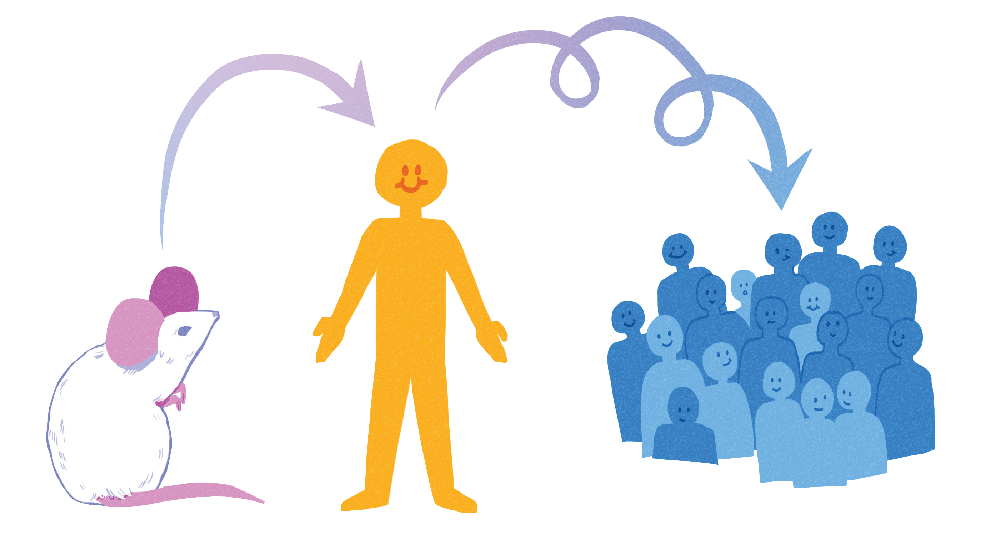
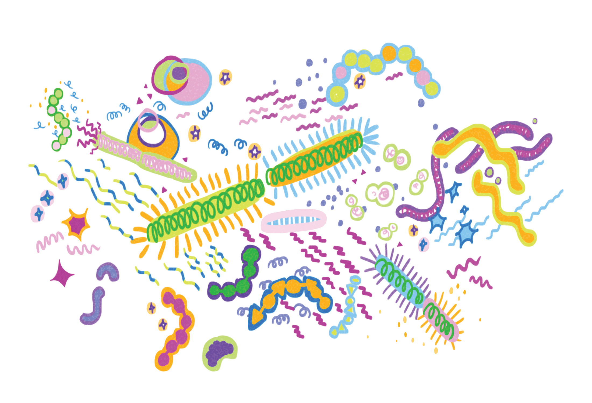

{}
Article originally published in [Issue 17 of Grey Matters Journal](https://greymattersjournal.org/a-gut-feeling/).
{}

*Art by [Nina Chen](https://greymattersjournal.org/author/nina/).*

Bacteria have a historically well-deserved bad rap. After all, they make us sick and spoil our food. Therefore, a natural reaction to hearing that around a hundred trillion bacteria inhabit us would be disgust, fear, or maybe even confusion [^1]. However, human-inhabiting bacteria aren’t as scary as they sound. These bacteria, collectively called microbiota, normally don’t harm us, and instead actually contribute to many human functions like digestion and, more surprisingly, stress and emotion.

Clinical research on the symbiotic relationship between our body and the bacteria that inhabit us suggests that our microbiota may have an influence on our emotions. Previously, scientists had only observed direct evidence of the two-way communication system linking the gut and the brain in other mammals, such as rats and mice, but now we know this mechanism exists in humans as well. This discovery has provided us with a new perspective on major psychological disorders, such as depression, anxiety and schizophrenia. With these findings, there are new avenues of treatment to explore, such as altering the composition of an individual’s microbiota to alter their mood [^2].

## The biology behind the ’biota

To understand how the relationship between microbiota, gut, and the brain affects psychological disorders, we must first understand the relationship between the gut and the brain: the gut-brain axis.

The gut-brain axis is a highway connecting the gut and brain that carries messages one way or the other, telling the brain to stop doing a certain activity and the gut to start doing a certain activity, or vice versa. Messages either travel along the axis as electrical signals through nerves or as signaling molecules through the bloodstream. The nerves involved in this communication network are involved in our fight-or-flight responses to stress, and our rest-and-digest responses that help us recover from stress. The axis also uses a wide variety of neurotransmitters, including a large percentage of the body’s serotonin and dopamine [^3]. Serotonin is mostly involved in positive mood, while dopamine is mostly involved in reward.

Out of several theories, one predicts bacteria might influence the vagus nerve, which is the major nerve connecting the brain and the gut in the gut-brain axis. Another theory states bacteria may influence major signaling pathways between intestinal cells and neurons, though there isn’t a clear consensus.

If we can understand how bacteria use gut-brain pathways to affect mood, we can adapt their methods to help treat psychiatric disorders that have been linked to specific parts of these pathways. More specifically, to treat symptoms of stress disorders, we can manipulate different bacteria in the microbiota.    

## The microbiota’s effect on stress-related behaviors:

The gut microbiota weren’t originally thought to have a direct influence on stress-related behaviors. However, in 2004, a study conducted by the Sudo research lab found that there was, in fact, a direct link between the microbiota and such behaviors [^3]. They found mice bred without a microbiota exhibited lower anxiety and higher exploration than normal mice with a healthy microbiota [^3]. In other words, the presence of a microbiota was found to increase stress-related behaviors.

The microbiota plays a large role in an organism’s stress-related behaviors, but it might also have a major role in brain development [^4]. The Desbonnet research lab treated adolescent mice with antibiotics, altering the composition of the mice’s microbiota. When the mice grew up, they exhibited less anxiety-like behaviors than normal mice. However, these mice also didn’t exhibit thought processes that the normal mice did, such as being able to distinguish between familiar and unfamiliar objects or being able to learn when other mice started avoiding a certain type of food. This impaired processing could be linked to observed decreases in the expression of genes associated with brain development in treated mice. This means that the decrease in anxiety in the antibiotic-treated mice came at the cost of cognitive deficits in parts of the brain involved in memory and regulatory mechanisms [^4]. While removing or directly altering our microbiota during growth might reduce our levels of stress-related behaviors, it may also have the unintended consequence of hurting the development of other important parts in our brain. This means that a treatment for depression involving the removal or significant alteration of someone’s microbiota before their brain is fully developed could potentially harm their brain’s normal development. An example of a consequence could be an effect on our ability to carry out even simple tasks, like facial or object recognition. This consequence is especially pertinent when considering that 18 to 25-year-olds have the highest prevalence of major depression out of all adults in the U.S., since human brains aren’t fully developed until around the age of 25 [^5][^6]. Such a treatment couldn’t be safely prescribed to the age group most affected by depression.

Besides the possible negative effects of removing one’s microbiota could have on normal brain development, more recent research suggests that it isn’t the entire microbiota that cause disorders [^7]. Instead, specific stress-related microbiota compositions lead to increased stress-related behaviors, even across species. In one study, when samples of depressed human patients’ microbiota were transplanted to rats without a microbiota, the anxiety-like behaviors of these rats increased in comparison to rats with samples of healthy human patients’ microbiota transplanted in them. This result suggests that the presence of bacteria specific to depressed people’s microbiota is linked to their depressed behavior [^7]. This bodes well for the applicability of animal research to humans, which is especially relevant because there are many fewer studies conducted on humans than animals.

Several studies have been conducted to explore treatments modifying the microbiota in specific ways. Probiotics, microbes that can be eaten for health benefits, have been shown to reduce anxiety-like behaviors in animals [^8]. The effects of stress in rats were reversed after they ingested a probiotic adding a specific strain of bacteria to their microbiota. This bacteria’s presence was associated with an improvement in behavior and hormonal balance [^8]. If this probiotic, or a similar one decreasing the effects of stress-related behavior in humans were to be discovered, then it would definitely be a feasible treatment for stress-related disorders. The empirical testing of how certain probiotics affect human behavior has yet to be completed.

## But…. there’s a catch:

Despite all of the aforementioned research, only some of the research is definitively applicable to humans because of the scarcity of human volunteers. Even if people do volunteer, there’s always the chance that a treatment that worked well on animals won’t work in humans. As a result, the evidence for bacteria influencing stress-related behaviors in humans is often indirect or by conceptual application.

A 2016 study did manage to partially replicate the findings of previous studies conducted on anxious mice. The mice had reduced levels of stress and increased cognition after eating food supplemented with a specific species of bacteria, Bifidobacterium longum 1714 [^9][^10]. The Allen research lab found that when healthy human male volunteers ate the same bacteria, their daily reported stress decreased [^11]. While these results do indicate that eating this strain of Bifidobacterium reduces stress levels in these human participants, we can’t be too quick to generalize this to all humans. The subjects tested were all male volunteers, and thus are not representative. In addition, while the Allen research lab likely did account for differences in how each participant reported stress levels, self-reported stress levels are more subject to human biases than direct observation of stress-related behaviors [^11]. Individually, this study doesn’t show nearly as much evidence that the microbiota and stress-related behaviors are related as many animal studies do. But the fact that scientists have been able to replicate one such study indicates that while difficult, it is possible someday for us to have a similar level of direct evidence linking the microbiota and stress-related behaviors for humans as we do for other organisms. Establishing this link directly in humans will better allow us to understand the mechanisms underlying stress-related disorders and will give us a new avenue of treating them through the microbiota.

Already, studies are being conducted to see if microbial treatments such as probiotics will be as effective in humans as they are in animals. Most recently, in 2018, a study found that when healthy human volunteers ingested probiotics, their scores for depression and anxiety questionnaires improved [^12]. Specifically, their reported positive outlook on life increased, and their vulnerability to depression in terms of hopelessness and risk aversion decreased. Patterns of brain activation with regards to emotional memory also changed within volunteers. These results, like the results of Allen’s study, indicate that altering the microbiome in humans can decrease our stress-related behavior. However, this study was also conducted using volunteers and self-reports of behavior, meaning that we should be wary of generalizing the results to all humans. We also don’t know if this treatment will work the same way on someone with anxiety or depression, since this study was only conducted on healthy subjects. Despite these drawbacks, it is important to note that this study is the first to report that probiotics have an influence on humans on a behavioral level. Expanding on these results is the first step in the right direction towards using probiotics as direct treatments for stress-related disorders. If researchers keep exploring the effects of ingesting different bacteria through probiotics, they may find that some will reduce stress-related behaviors in humans. In the future, we may be able to use these bacteria to treat depression or anxiety.

## Conclusion:

While we do need more studies exploring the link between microbiota and stress-related behavior in humans, there are always ethical questions that come into play whenever humans become involved in research. There have been some scenarios in past human studies where volunteer subjects weren’t properly informed about the scope or implications of participating. Since the links between microbiota and human emotion are not yet fully uncovered, the risks of manipulating the microbiota are still unknown. There are possible health concerns if a study on altering someone’s microbiota goes wrong, since as shown in Desbonnet’s study, there can be unforeseen side effects, such as unwanted negative effects on other thought processes and behaviors [^4].

It’s also important to keep in mind that the composition of a person’s microbiota can tell us a lot about a person and their lifestyle, just like DNA. Participating in a study recording the composition of your gut bacteria seems akin to using 23andMe, a biotech company that genotypes people so they can find out their ancestry and possible health risk factors in their genome. Like the genetic information you provide 23andMe with, information about your gut bacteria you may give up for a research study isn’t nearly as private or obscure as you’d like to think it is.

However, that’s not to say that research on the human microbiota shouldn’t be conducted. Researchers and volunteers should keep in mind the many ethical implications of the studies they are taking part in. Even so, we’ve already seen an overwhelming amount of positive results so far showing how it’s possible to reduce stress-related behaviors just by slightly altering an animal’s microbiota. These results seem to indicate more steps towards a more effective therapy for psychological disorders than towards a loss of privacy and security around our gut feelings.

### **Check out the rest of Issue 17 of Grey Matters Journal [here](https://greymattersjournal.org/tag/issue-17/)!**

[^1]: American Society for Microbiology. (2014) [https://www.asm.org/](https://www.asm.org/)
[^2]: Pasricha, Pankaj [Stanford Health Care]. (2011, March 2). Stanford Hospital’s Pankaj Pasricha discusses the Enteric Nervous
    System, or brain in your gut [Video File]. [https://www.youtube.com/watch?v=UXx4WTVU34Y](https://www.youtube.com/watch?v=UXx4WTVU34Y)
[^3]: Sudo N, Chida Y, Aiba Y, Sonoda J, Oyama N, Yu XN, Kubo C, Koga Yasuhiro. (2004). Postnatal microbial colonization programs
    the hypothalamic-pituitary-adrenal system for stress response in mice. Journal of Physiology, 558, 263-275. doi: 10.1113/jphysiol.2004.063388
[^4]: Desbonnet L, Clarke G, O’Sullivan O, Cotter P, Dinan T, Cryan J. (2015) Gut microbiota depletion from early adolescence in 
    mice: implications for brain and behavior. Brain Behavior and Immunology, 48, 165-173. doi: 10.1016/j.bbi.2015.04.004
[^5]: Major Depression. National Institute of Mental Health (2019). 
    [https://www.nimh.nih.gov/health/statistics/major-depression.shtml](https://www.nimh.nih.gov/health/statistics/major-depression.shtml)
[^6]: Johnson SB, Blum RW, Giedd JN. (2009). Adolescent Maturity and the Brain: The Promise and Pitfalls of Neuroscience Research
     in Adolescent Health Policy. Journal of Adolescent Health , 45(3): 216–221. doi: 10.1016/j.jadohealth.2009.05.016
[^7]: Kelly JR, Borre Y, Aidy S, Deane J, Patterson E, Kennedy PJ, Beers S, Scott K, Moloney G, Scott L, Ross P, Stanton C, 
    Clarke G, Cryan JF, Dinan TG. (2016). Transferring the blues: depression-associated gut microbiota induces neurobehavioral changes in the rat. European Psychopharmacology, 82, 109-118. doi:10.1016/j.jpsychires.2016.07.019.
[^8]: Liang S, Wang T, Hu X, Luo J, Li W, Wu X, Duan Y, Jin F. (2015). Administration of Lactobacillus helveticus NS8 improves
    behavioral, cognitive and biochemical aberrations caused by chronic restraint stress. Journal of Neuroscience, 310, 561-577. doi: 10.1016/j.neuroscience.2015.09.033.
[^9]: Savignac HM, Kiely B, Dinan TG, Cryan JF. (2014) Bifidobacteria exert strain-specific effects on stress-related behavior
    and physiology BALB/c mice. Neurogastroenterology Motil , 26, 1615-1627. doi: 10.1111/nmo.12427.
[^10]: Savignac HM, Tramullas M, Kiely B, Dinan TG, Cryan JF. (2015). Bifidobacteria modulate cognitive processes in an anxious
    mouse strain. Journal of Behavioral Brain Research , 287, 59-72. doi: 10.1016/j.bbr.2015.02.044.
[^11]: Allen AP, Hutch W, Borre Y, Kennedy P, Temko A, Boylan G, Murphy E, Cryan JF, Dinan TG, Clarke G. (2016) Bifidobacterium 
    longum 1714 as a translational psychobiotic: modulation of stress, electrophysiology and neurocognition in healthy volunteers. Translational Psychiatry, 6, e939. doi: 10.1038/tp.2016.191.
[^12]: Bagga D, Reichert J, Koschutnig K, Aigner C, Holzer P, Koskinen K, Moissl C, Eichinger, Schöpf V. (2018). Probiotics drive
    gut microbiome triggering emotional brain signatures. Gut Microbes. 9(6):486-496. doi:10.1080/19490976.2018.1460015.
