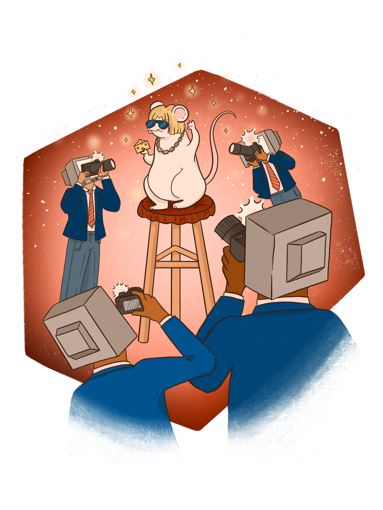
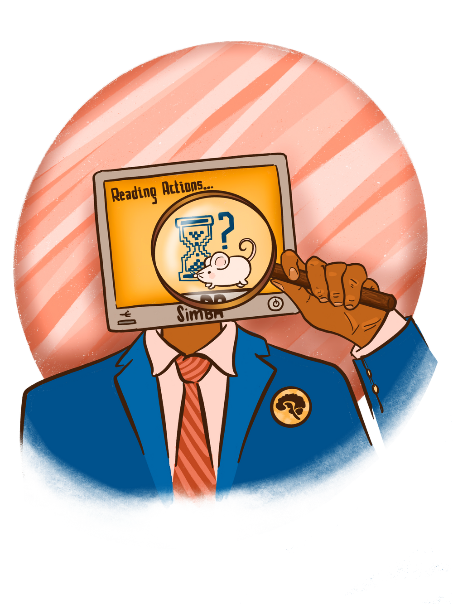

{}
Article originally published in [Issue 24 of Grey Matters Journal](https://greymattersjournal.org/pandemic-dreams/).
{}

*Art by [Jonathan Bustamante Osorio](https://greymattersjournal.org/author/jonathan-bustamante-osorio/).*

## Hello, Behavioral Neuroscience World

One of neuroscience’s most foundational questions has always been understanding the neural basis of behavior. It is essential to identify what exactly in our brain produces our behaviors, from our habits and emotions to the way we interact with others. Uncovering the neural mechanisms that govern behavior gives doctors and psychologists alike insight into what changes result from or may cause neuropsychiatric disorders, injuries, or aging. Even more fundamentally, it gives us a better understanding of who we are, why we do the things we do, want the things we want, and think the things we think. Knowledge of these mechanisms offers us a chance at knowing who we truly are as individuals and as a species.

But even as recently as the eighties and nineties, this question has remained unanswered. The field has lacked the capabilities to answer it, and while many neuroscientists never forgot the bigger picture, solving this particular puzzle turned into a distant dream rather than possible reality. This was for a multitude of reasons, chiefly being that we lacked the technology to conduct even large-scale brain activity recordings. This technology is essential to neuroethology, the study of neural activity patterns that underlie natural behavior.

Enter the twenty-first century and its numerous technological advances. Researchers gained the capability to collect very precise neurophysiological recordings. However, this increased precision in the collection of neurophysiological data was not accompanied by similar advances in conducting behavioral analyses [^1]. As a result, neuroscience experiments that were centered around behavioral assays fell behind their physiological counterparts. To be able to conduct replicable research on behavior and relate it to quantitative physiological data, behavior must also be quantified in some way. With these recent developments, research that could collect extremely precise, real-time neural activity data unfortunately lacked an equally precise behavioral quantification component. Thus, researchers couldn’t draw strong associations between the two [^1].

This lack of precision was mainly due to researchers continuing to do behavioral scoring and analysis by hand [^2]. Not only is training human scorers time-intensive, but the scoring itself is also highly variable from individual to individual. A single person may even become fatigued as they score, leading to a lack of consistency both across and within scorers. Moreover, humans simply can’t record data as well as computers do. This makes it hard for researchers to associate time-specific changes in neural activity in specialized brain circuits with behavior patterns [^2].

However, with the rise of computers and algorithms modeling human cognition, behavioral neuroscience has been rebooted. Computational models offer a new way of looking at the brain, decision-making, and behavior while also holding the potential to optimize behavioral analysis [^2]. In the hopes of overcoming the limitations of manual behavioral quantification, researchers have developed several computational methods intended to quantify behavior in a precise and standardized manner.

## Automating Animal Tracking

The most popular computational methods for behavioral computation are currently all machine-learning based. This is for several reasons. In the open-source form that has predominated the behavioral neuroscience field, machine learning allows results to be easily validated and explained by researchers, even those with no computational background. Researchers have recognized the need for machine learning models for the purpose of advancing the field and, in the last five years, multiple open-source machine learning programs have been released.

The methods discussed in this article are examples of supervised machine learning, where the model is provided with labeled data that it learns to classify from, as opposed to unsupervised machine learning, where models are given unlabelled data and must work on their own to find patterns or distinguishing features [^3] [^4] [^21] [^22] [^23]. Unlike unsupervised machine learning, supervised learning models cannot identify new patterns of behavior associated with a behavior of interest, or use features previously thought unrelated to the behavior of interest. Unsupervised model classifications may be dependent on features indistinguishable to the human eye. Supervised learning, which feeds a model pre-labeled data, ensures classifications are interpretable to researchers. Furthermore, through their multiple checkpoints, supervised machine learning models allow researchers to tune the process to their needs as they see fit. They also allow for the human validation of machine-generated classification accuracy in an intuitive manner. By training the model on labelled data, the model then has a framework for comparison in what it should be looking for. This makes supervised machine learning models useful in classifying and predicting behaviors human researchers are previously aware of [^3] [^4].

While the behavioral classification process itself uses machine learning, before a machine learning model can learn to distinguish behaviors, it must be provided with animal tracking information. This information comes in two parts: animal tracking, the identification of the animal itself; and pose estimation, the estimate of the position of relevant body parts [^5]. Both of these require that the animal and body parts of interest be distinguishable from their surroundings and other animals [^4]. Older methods relied on background subtraction or distinguishing the animal from its surroundings based on pixel color and size [^6] [^7]. Others turned to the incorporation of depth sensors— much like those in home technology like Apple’s Face ID and Microsoft Kinect— or physically marking animal body parts to accurately track animal trajectories [^6] [^7] [^8]. However, this approach to animal tracking and pose estimation not only requires setups utilizing multiple cameras or sensors, but is also extremely sensitive to changes in experimental conditions such as lighting and cage material. A deeper problem, and one of the reasons for researchers’ continued reliance on human scoring, is that these approaches are primarily only available commercially, making them very expensive. Overall, due to lack of accessibility, such methods lack generalizability and often measure behavior less accurately than human scoring [^9]. As a result, more recent systems for pose estimation have moved towards the incorporation of machine learning and deep neural networks, which are more accurate and more adaptable to changes in video recordings [^9].

Deep neural network applications for pose estimation include open-source programs such as DeepLabCut, DeepPoseKit, and SLEAP [^5] [^10] [^11]. These programs are trained iteratively with data in the form of video frames labeled with animal body part positions.This data is split into training data, which a researcher has previously labelled body part positions on, and testing data, which the algorithm annotates on its own, using what it has ‘learned’ from the way in which the training data is annotated. Once processed, body part positions are tracked across the course of the video. Deep neural networks will compute the probability of a body part being in each pixel based on the training data, and generate tracking predictions for the location of each body part based on the probabilities across all the pixels for a video frame. Predictions can be corrected by a program’s user, so that when the algorithm is given a new set of data, the time it takes to label these frames will be reduced. In other words, the algorithm learns not only from receiving more data, but also from the feedback a user gives it in refining its predictions. Another feature of deep neural networks is they can be reused and made more robust by being applied to and then trained on different data with the same core set of features to track. This process, known as transfer learning, can accelerate the training and improve the performance of a model. For example, if an algorithm was originally trained on identifying white mice, and is repurposed to identify black mice, the process is less time-intensive. In pose estimation models, this has been particularly useful due to the massive datasets available for object recognition. The application of transfer learning cuts down on the amount of pre-labeled data the researchers must provide while still allowing them to refine predictions as they see fit [^5].

## Building Better Behavioral Models

Once animal tracking and pose estimation is complete, machine learning models function in a formulaic manner. First, videos of behavior previously classified by a person are provided to the model, along with the person’s time-specific labels of when behaviors are occurring [^2]. The more videos in this step, the better, and it also helps if multiple people perform the initial video labeling process. Think of it as if you were trying to teach a child how to identify something by example alone—only you can’t use words, all you can do is point to it when you see it. For both the child in our example and for machine learning models, we want to provide a range of examples that could represent our thing of interest so that their definition of the thing of interest does not become too narrow or context specific. Without a robust set of training data, machine learning models suffer from what is known as overfitting: the model ‘learns’ by memorizing the training data and can classify it extremely well, but its accuracy declines when provided novel data [^2].

From this initial set of training videos, the model extracts features it finds to be important in classifying the behavior using the researcher’s definition [^2]. In other words, it plays detective. The words we use to describe behaviors are meaningless to the model. How then does a model learn what to look for when identifying a behavior of interest? Let’s take a look at the process by which a machine learning model ‘learns’ to classify a behavior using the example of the machine learning pipeline Simple Behavioral Analysis (SimBA), developed by the Golden Lab at the University of Washington [^3]. SimBA was originally tested on the classification of social behaviors in rats and mice related to aggression, but is now used for a diverse range of behaviors across species, from zebrafish to wasps [^12] [^13]. Say we want to classify ‘attack’ versus ‘non-attack’ behavior in our videos. Though we can tell the model that the first three seconds of a video are ‘attack’ or the middle 4 seconds are ‘not attack’, SimBA has no knowledge outside of our labels of what makes the two time frames distinct. It must determine in its own way the best method in which to distinguish between the two labels [^3].

Returning to our detective metaphor, the model tries to find the most compelling pieces of evidence to support their case. A five second video clip displaying an attack contains other components that play varying parts in predicting whether an attack occurred or not [^3]. These components may include animal movement speed, position of the aggressor animal’s nose relative to the other’s, or even position of one mouse’s tail tip relative to the other’s. Out of these three examples, we can hypothesize that animal movement speed and position of the aggressor’s nose relative to the other’s are probably better evidence of an attack than position of mice tail tips. SimBA uses the output of pose estimation software, such as DeepLabCut to come to similar conclusions when classifying behavior in a process known as feature extraction. Programs like DeepLabCut output the x-y positions of labeled body parts, and SimBA performs a variety of calculations using these positions, including movement speed and body part distance scaled to the size of the cage [^3] [^5].

Then, to test the importance of each extracted feature in correctly predicting whether a behavior of interest is occuring, SimBA pulls from random samples of features and weighs them against each other [^3]. Specifically, the method used compares how well two different features can split or sort the data into predefined groups such as ‘attack’ or ‘non-attack.’ It does so for many random samples of features simultaneously, and from these comparisons, it generates a list of the most important features. Each feature is used as a piece of evidence to make a case for ‘attack’ or ‘non-attack,’ and a majority decision across the features is necessary for a behavior to be definitively classified [^3].

This method is known as a random forest algorithm and is less time intensive than a similar method known as gradient boosting, which conducts the same process, but is known for calculating feature importance in a less biased manner. Gradient boosting is used by JAABA, a behavioral classifier developed for the purpose of classifying different types of walking and grooming behavior present in different mice and fly breeds [^4]. Rather than using a majority vote between important features in classification, models that utilize gradient boosting create their models in series. This means that they start with a single random sample of features from which they extract the most important features and attempt to classify a behavior, then continue to compare features to build on the model and improve it. However, while gradient boosting may improve the model’s predictive accuracy, this improvement comes at the risk of overfitting the training data [^4].

Once the model is built using either of these methods, researchers can see for themselves how well their model is performing [^3][^4]. Not only can they see how well it classifies training data, they can also see how this classification occurs, which features the model is using more in its predictions, and which it places less emphasis on. This provides researchers with the opportunity to validate their model based on its performance, as well as how intuitive the selected features are [^3][^4]. The researchers must then ask themselves: are these features what we’d expect from the behavior and how we manually classify it?

Depending on the answer, researchers can either choose to give the model more training data and once again assess its performance, or create a new model from scratch by providing a completely new set of training data [^3] [^4]. If the performance of the model is lacking, it could be because either it hasn’t been trained on enough data, or because the training data was improperly labeled. In both cases, researchers may provide the model with additional data to see if it improves the model’s performance. If the model still performs poorly, they may choose to create a new model from scratch. Once satisfied with their model, researchers can proceed to the final step of the process: providing the model with testing data completely new to both the model and to the researcher themselves. Once the model is finished classifying the data, researchers again have the option to validate for themselves its performance by watching videos annotated by the model or examining frames labelled for the behavior, and if necessary, retrain the model [^3] [^4].

If researchers recorded neural activity in real time during the behavioral experiment, they can now align these electrophysiological recordings with behavioral annotations output by the classifier [^3]. Not only can these two metrics be aligned more precisely than before, with behavioral predictions being a mathematical calculation of probabilities based on important features, researchers can run statistical tests on the correlation between the two variables. This allows researchers to associate time-specific changes in neural activity of specialized brain circuits with behavioral patterns to a greater degree [^3].

## We Are What We Code

The ability of researchers to easily validate and tune models based on their own classifications is one of the key reasons why they have utilized supervised machine learning for the purpose of automating behavioral classification. But the fact that  supervised machine learning models are trained on human classification of behavior is a double-edged sword. A model is also only as good as the data it’s trained on. If the classifications it’s given are full of human variability and error, the classifications it returns to the researchers will also be. Inadvertently creating biased models is potentially dangerous or harmful when one considers the scope of the research these models will be utilized for.

While the machine learning models discussed in this article have only been used on non-human animal models thus far, the aim of behavioral neuroscience is to shed light on neuropsychiatric disorders, which are especially prevalent among populations of racial or socioeconomic minorities [^14] [^15]. The possibility of machine learning applications shaping the treatment of these patients means that behavioral neuroscientists looking to apply these methods must be conscious of their own internal biases in their approach and their implications. In the words of coders: “garbage in, garbage out.” If research is skewed in who is conducting or how they’re conducting it, our models will reflect that, and conclusions we draw from the data classified, too.

Already, in commercial applications of algorithms meant to automate or expedite processes, we see our own internalized biases reflected back at us. Machines programmed to filter through job applications often fall into racist and sexist patterns [^16]. Even more damningly, face detection and recognition software created for the purpose of security and surveillance often fails when it comes to racial minorities, particularly Black people, Asian people, and Native Americans [^17]. Measures have been taken to regulate and audit the performance of algorithms— including but not limited to the Algorithmic Accountability Act introduced in Congress by Sen. Cory Booker, Ron Wyden, and Rep. Yvette Clark, and grassroots efforts calling for regulation of face recognition technology, as well as multiple projects such as Gender Shades, which implement facial analysis benchmark datasets to evaluate algorithm classification [^18] [^19] [^20].

As deep and machine learning methods become the standard for behavioral neuroscience research, researchers must similarly do their part by being aware of their unconscious biases and taking steps to minimize the possibility of including harmful biases in their classifications. The implementation of unsupervised machine learning models could arguably decrease a model’s possible biases by removing the human element of the classification process altogether. As mentioned previously, however, this may come at the cost of interpretability. In fact, a simpler solution may exist: training classification models on diverse data labelled by many neuroscientists, not just those able to afford commercially-offered machine learning algorithms.

While each of these programs has its own caveats and are less polished than a similar corporation-backed venture, programmers make an effort to make their code accessible to all within the field with detailed documentation of what each part of the process does [^21][^22][^23]. They also package them in user-friendly interfaces that allow for the use of the machine learning algorithms without needing coding experience [^10]. In this way, not only do these programs open new avenues of behavioral neuroscience research by providing a way around the often insurmountable paywall barrier to commercial models, but they also hopefully allow researchers with a diversity of backgrounds to conduct this research, which has the potential to reduce aggregation of socioeconomic and racial biases. Though they may not completely eliminate biases, open-source methods set a standard for inclusivity and transparency in science.

Building better algorithms necessitates the opening of doors for new, previously unheard voices in science. This is why the discussion of machine learning models here is focused mainly on open-source programs despite several of them existing in papers not currently peer-reviewed. As these programs are each a work in progress, the direction each update takes in adding to programs is a conversation between researcher and coder. Programs end up tuned to research needs as they come and consequently grow more robust as a result. Their open source nature and accessibility also encourage an often-overlooked but integral aspect of science: researchers building off of one another’s data or ideas and collaborating to bring us closer to the neurological basis of behavior one dataset at a time.

### **Check out the rest of Issue 24 of Grey Matters Journal [here](https://greymattersjournal.org/tag/issue-24/)!**

{}
Support open science by trying out one of the many tools mentioned in the article (and more) in your research today: [**SimBA**](https://github.com/sgoldenlab/simba), [**SLEAP**](https://github.com/talmolab/sleap), [**Keypoint-MoSeq**](https://github.com/dattalab/keypoint-moseq), [A-SOiD and B-SOiD](https://github.com/YttriLab), [DeepLabCut](https://github.com/DeepLabCut/DeepLabCut), [DeepPoseKit](https://github.com/jgraving/DeepPoseKit), [JAABA](https://jaaba.sourceforge.net/), [Anipose](https://github.com/lambdaloop/anipose), [DANNCE](https://github.com/spoonsso/dannce), [MARS](https://github.com/neuroethology), [VAME](https://github.com/LINCellularNeuroscience/VAME). Feel free to [reach out](/#contact) if you have any questions!
{}

[^1]: Egnor, S. E., & Branson, K. (2016). Computational Analysis of Behavior. Annual review of neuroscience, 39, 217–236.
    [https://doi.org/10.1146/annurev-neuro-070815-013845](https://doi.org/10.1146/annurev-neuro-070815-013845)
[^2]: Goodwin, N. L., Nilsson, S., & Golden, S. A. (2020). Rage Against the Machine: Advancing the study of aggression ethology
     via machine learning. Psychopharmacology, 237(9), 2569–2588. [https://doi.org/10.1007/s00213-020-05577-x] (https://doi.org/10.1007/s00213-020-05577-x)
[^3]: Nilsson SRO, Goodwin NL, Choong JJ, et al. (2020) Simple Behavioral Analysis (SimBA): an open source toolkit for computer
    classification of complex social behaviors in experimental animals. [bioRxiv 2020.04.19.049452. 10.1101/2020.04.19.049452] (https://www.biorxiv.org/content/10.1101/2020.04.19.049452v2). Pre-Print.
[^4]: Kabra, M., Robie, A. A., Rivera-Alba, M., Branson, S., & Branson, K. (2013). JAABA: interactive machine learning for
     automatic annotation of animal behavior. Nature methods, 10(1), 64–67. [https://doi.org/10.1038/nmeth.2281] (https://doi.org/10.1038/nmeth.2281)
[^5]: Mathis, A., Mamidanna, P., Cury, K. M., Abe, T., Murthy, V. N., Mathis, M. W., & Bethge, M. (2018). DeepLabCut: markerless
     pose estimation of user-defined body parts with deep learning. Nature neuroscience, 21(9), 1281–1289. [https://doi.org/10.1038/s41593-018-0209-y](https://doi.org/10.1038/s41593-018-0209-y)
[^6]: Noldus, L. P., Spink, A. J., & Tegelenbosch, R. A. (2001). EthoVision: a versatile video tracking system for automation of
    behavioral experiments. Behavior research methods, instruments, & computers : a journal of the Psychonomic Society, Inc, 33(3), 398–414. [https://doi.org/10.3758/bf03195394](https://doi.org/10.3758/bf03195394)
[^7]: Hong, W., Kennedy, A., Burgos-Artizzu, X. P., Zelikowsky, M., Navonne, S. G., Perona, P., & Anderson, D. J. (2015)
    Automated measurement of mouse social behaviors using depth sensing, video tracking, and machine learning. Proceedings of the National Academy of Sciences of the United States of America, 112(38), E5351–E5360. [https://doi.org/10.1073/pnas.1515982112] (https://doi.org/10.1073/pnas.1515982112)
[^8]: Ohayon, S., Avni, O., Taylor, A. L., Perona, P., & Roian Egnor, S. E. (2013). Automated multi-day tracking of marked mice
     for the analysis of social behaviour. Journal of neuroscience methods, 219(1), 10–19. [https://doi.org/10.1016/j.jneumeth.2013.05.013] (https://doi.org/10.1016/j.jneumeth.2013.05.013)
[^9]: Sturman, O., von Ziegler, L., Schläppi, C. et al. Deep learning-based behavioral analysis reaches human accuracy and is
    capable of outperforming commercial solutions. Neuropsychopharmacol. 45, 1942–1952 (2020). [https://doi.org/10.1038/s41386-020-0776-y] (https://doi.org/10.1038/s41386-020-0776-y)
[^10]: Graving, J. M., Chae, D., Naik, H., Li, L., Koger, B., Costelloe, B. R., & Couzin, I. D. (2019). DeepPoseKit, a software
     toolkit for fast and robust animal pose estimation using deep learning. eLife, 8, e47994. [https://doi.org/10.7554/eLife.47994](https://doi.org/10.7554/eLife.47994)
[^11]: Pereira, T. D., Aldarondo, D. E., Willmore, L., Kislin, M., Wang, S. S., Murthy, M., & Shaevitz, J. W. (2019). Fast animal
     pose estimation using deep neural networks. Nature methods, 16(1), 117–125. [https://doi.org/10.1038/s41592-018-0234-5](https://doi.org/10.1038/s41592-018-0234-5)
[^12]: Newton KC, Kacev D, Nilsson SRO, Golden SA, Sheets L. (2021) Lateral Line Ablation by Toxins Results in Distinct Rheotaxis
     Profiles in Fish. bioRxiv 2021.11.15.468723; doi: [https://doi.org/10.1101/2021.11.15.468723](https://doi.org/10.1101/2021.11.15.468723). Pre-Print.
[^13]: Jernigan CM, Stafstrom JA, Zaba NC, Vogt CC, Sheehan MJ. (2021) Color is necessary for specialized face learning in the
     Northern paper wasp, Polistes fuscatus. bioRxiv 2021.10.03.462925; doi: [https://doi.org/10.1101/2021.10.03.462925] (https://doi.org/10.1101/2021.10.03.462925). Pre-Print.
[^14]: Toumbourou, J. W., Hemphill, S. A., Tresidder, J., Humphreys, C., Edwards, J., & Murray, D. (2007). Mental health 
    promotion and socio-economic disadvantage: lessons from substance abuse, violence and crime prevention and child health. Health promotion journal of Australia : official journal of Australian Association of Health Promotion Professionals, 18(3), 184–190. [https://doi.org/10.1071/he07184](https://doi.org/10.1071/he07184)
[^15]: Substance Abuse and Mental Health Services Administration. (2020). Key substance use and mental health indicators in the 
    United States: Results from the 2019 National Survey on Drug Use and Health (HHS Publication No. PEP20-07-01-001, NSDUH Series H-55). Rockville, MD: Center for Behavioral Health Statistics and Quality, Substance Abuse and Mental Health Services Administration. Retrieved from [https://www.samhsa.gov/data/](https://www.samhsa.gov/data/)
[^16]: Zou, J., & Schiebinger, L. (2018). AI can be sexist and racist - it's time to make it fair. Nature, 559(7714), 324–326.
    [https://doi.org/10.1038/d41586-018-05707-8](https://doi.org/10.1038/d41586-018-05707-8)
[^17]: Grother P. Ngan M, Hanaoka K. (2019). Face Recognition Vendor Test (FRVT) Part 3: Demographic Effects. National Institute
     of Standards and Technology Interagency or Internal Report 8280 Natl. Inst. Stand. Technol. Interag. Intern. Rep. 8280.
[^18]: Algorithmic Accountability Act, H.R.2231, 116th Congress. (2019).
    [https://www.congress.gov/bill/116th-congress/house-bill/2231](https://www.congress.gov/bill/116th-congress/house-bill/2231)
[^19]: ACLU. (2021) Face Recognition Grassroots Letter to Congress. 
    [https://www.aclunc.org/sites/default/files/2021.06.17_Face_recognition_grassroots_letter.pdf](https://www.aclunc.org/sites/default/files/2021.06.17_Face_recognition_grassroots_letter.pdf). Accessed Dec. 12 2021.
[^20]: Buolamwini J, Gebru T. (2018) Gender Shades: Intersectional Accuracy Disparities in Commercial Gender Classification
     Proceedings of the 1st Conference on Fairness, Accountability and Transparency, PMLR 81:77-91, 2018.
[^21]: Weinreb, C., Pearl, J., Lin, S., Osman, M. A. M., Zhang, L., Annapragada, S., Conlin, E., Hoffman, R., Makowska, S.,
    Gillis, W. F., Jay, M., Ye, S., Mathis, A., Mathis, M. W., Pereira, T., Linderman, S. W., & Datta, S. R. (2023). Keypoint-MoSeq: parsing behavior by linking point tracking to pose dynamics. bioRxiv : the preprint server for biology, 2023.03.16.532307. [https://doi.org/10.1101/2023.03.16.532307](https://doi.org/10.1101/2023.03.16.532307)
[^22]: Hsu, A. I., & Yttri, E. A. (2021). B-SOiD, an open-source unsupervised algorithm for identification and fast prediction of
     behaviors. Nature communications, 12(1), 5188. [https://doi.org/10.1038/s41467-021-25420-x](https://doi.org/10.1038/s41467-021-25420-x)
[^23]: Luxem, K., Mocellin, P., Fuhrmann, F., Kürsch, J., Miller, S. R., Palop, J. J., Remy, S., & Bauer, P. (2022). Identifying
    behavioral structure from deep variational embeddings of animal motion. Communications biology, 5(1), 1267. [https://doi.org/10.1038/s42003-022-04080-7] (https://doi.org/10.1038/s42003-022-04080-7)

