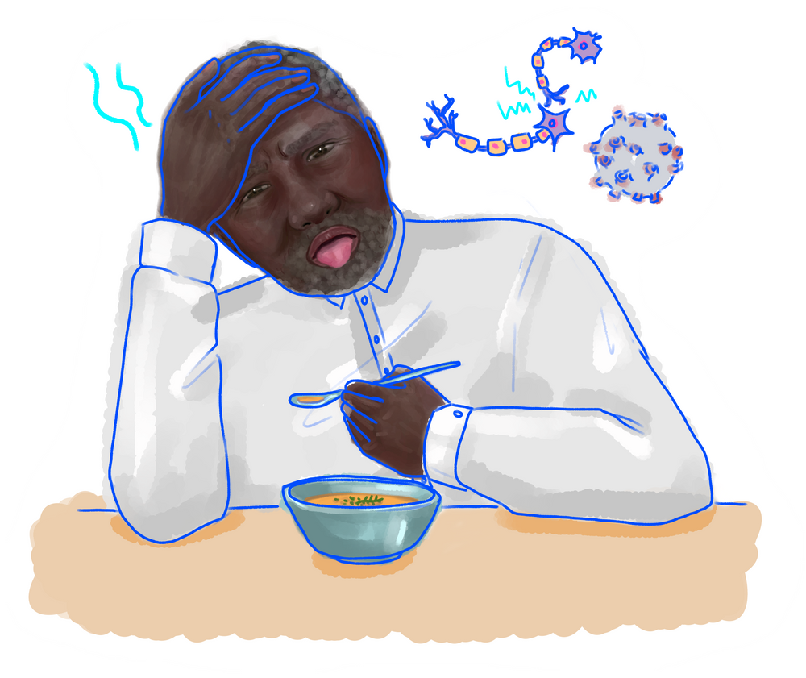
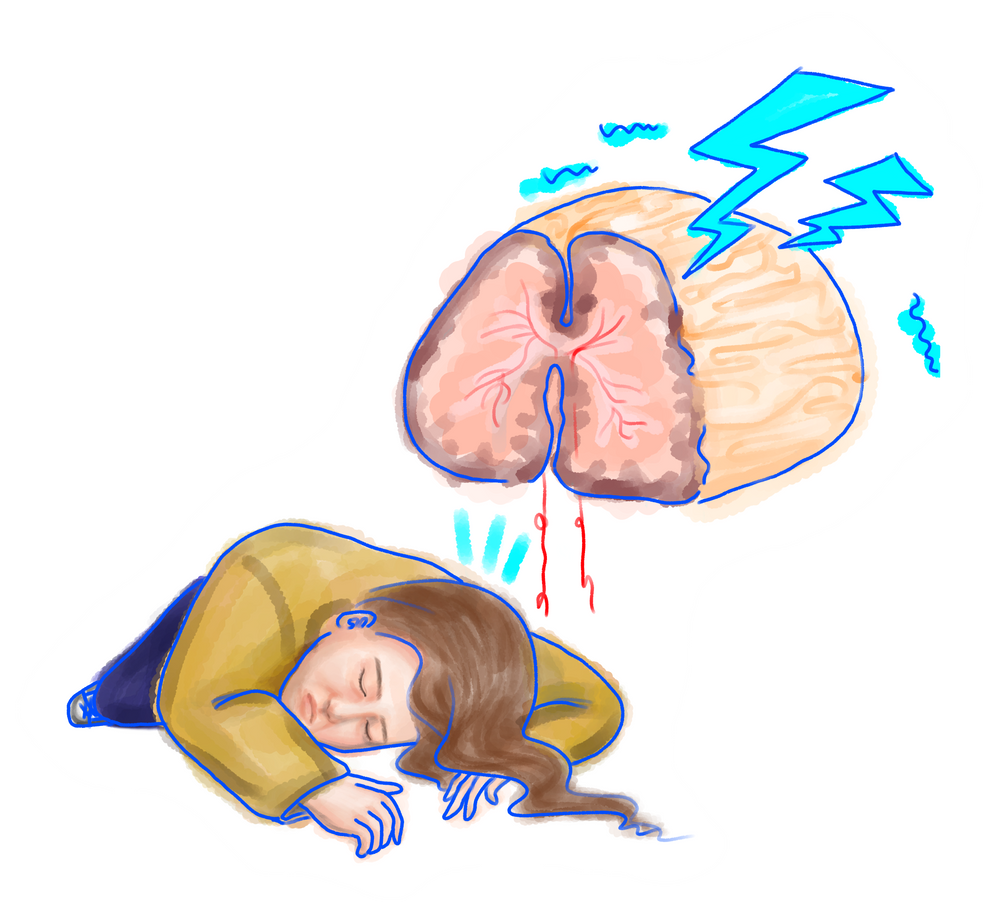

{}
Article originally published in [Issue 20 of Grey Matters Journal](https://greymattersjournal.org/covid-on-the-brain/). Cited studies come from literature searches done in January 2021, and may not be reflective of the most recent and up-to-date COVID-19 research.
{}

*Art by [Ohnshim Kim](https://greymattersjournal.org/author/ohmshim/).*

## Introduction

A sore throat. A cough. Difficulty breathing. In the post-2020 era, these symptoms are readily identifiable and directly related to an infection from the SARS-CoV-2 virus, which has taken the world by storm. We wear masks to stop ourselves from spewing viral particles into the air, and we distance ourselves from others to stay out of range of each other’s breaths. When we read about patients, we learn that many are left with diminished lung capacity even after recovery. The virus primarily attacks our respiratory system; often to a devastating, life-threatening degree. It’s no wonder that these respiratory failures have come to shape public understanding and knowledge of the disease itself.

There has been a lot of research concerning the effect of COVID-19, the disease caused by SARS-CoV-2, on the respiratory system. Treatments for COVID-19 patients are aimed at addressing and solving respiratory concerns brought about as the body fights the virus. While these symptoms are perhaps the most well-researched and understood at the moment, the damage and disruption COVID-19 inflicts extends well beyond the respiratory system [^1]. In late 2019, a group of researchers studying COVID-19 patients from several hospitals in Wuhan, China warned of the possibility of SARS-CoV-2 affecting the nervous system. The researchers observed several neurological symptoms in their COVID-19 patients, including headache and nausea [^2]. Since then, a growing body of research has emerged exploring the various ways in which SARS-CoV-2 impacts the nervous system. Researchers hope to elucidate how neurological damage caused by the virus may result in long-term consequences toward neurological health and function.

## Nervous System Background + Symptoms

Since the beginning of the COVID-19 pandemic, a number of individuals with the disease have reported suffering from acute losses to their senses of taste and smell. This indicates to scientists that the virus’ attack on the body is affecting the peripheral nervous system (PNS) given its role in sending signals to and from sensory organs in the body [^3]. These sensory losses, while not the most serious of COVID-19 symptoms, are intriguing because they are one of the most readily identifiable ones. Most viral infections create nasal congestion that leads to loss of smell, but this is not the case with COVID-19. In fact, loss of smell was a common symptom reported by patients who showed no obstruction to their nasal cavity [^4]. This discovery sparked a theory that these symptoms had a neurological basis: somehow, SARS-Cov-2 was disrupting normal activity of the olfactory nerve, interrupting signal transmission between the nose and the brain.

SARs-CoV (SARS), SARs-CoV-2, and MERS-CoV (MERS) are all viruses in the coronavirus family that share similar structures, including the spike protein, the protein each virus uses to bind to certain receptors on human cells and invade them [^2]. SARS and MERS have previously been found to attack cells in the cribriform plate, a bone that encases and protects the olfactory nerve as it extends from the nose to the brain. More concerningly, SARS has been found to heavily infect the central nervous system (CNS), which is the brain and spinal cord. Given these viruses’ similarity, scientists speculate that SARS-CoV-2 also affects both the PNS and CNS in a similar fashion [^2].

Some observational studies conducted assessing overall symptoms of COVID-19 patients support the hypothesis that the virus not only infects the PNS, but also attacks the CNS, producing a variety of symptoms [^5]. As opposed to PNS-based losses of smell and taste, CNS manifestations of the virus occur later in the progress of the disease and at a higher rate in patients who exhibit more severe COVID-19 symptoms [^5].

While the virus may only damage tissues surrounding neurons, researchers theorize the body’s immune response to COVID-19 harms the neurons themselves. A viral attack triggers the production of molecules known as cytokines, which serve as the body’s distress signals and first line of defense. These molecules call on the immune system to respond. The body sends immune cells to regions with an abundance of cytokines, increasing cytokine production. This causes inflammation, which is initially helpful in driving the immune response because it increases blood flow to an infected region of the body. This creates a positive feedback loop.

As the disease progresses and cytokine concentrations begin to rise uncontrollably (an event known as a cytokine storm), the risk of hyperinflammation increases, which may cause lasting damage to the already-infected cells and their surrounding tissues [^6]. Hyperinflammation of the tissues surrounding the brain can lead to cerebrovascular problems, which impact the delivery of blood to the brain. The most serious of these conditions, ischemic stroke, has been observed in COVID-19 patients. In this form of stroke, blood circulation to a patient’s brain is cut off by the narrowing or swelling of artery walls, and in many cases, it is fatal [^6].

COVID-19 is concerning to researchers because it could be even deadlier than previously thought because it might cause or exacerbate stroke and other cerebrovascular conditions. A comprehensive review of the literature on COVID-19’s association with stroke found that there was not a statistically significant increase in the number of severe cases of COVID-19 in patients with increased susceptibility to stroke. However, COVID-19 patients overall experienced strokes at a higher rate than would otherwise be expected [^6]. As such, researchers and physicians have implemented guidelines and treatment recommendations to account for the possibility that COVID-19 could result in the increased risk of stroke, especially for more elderly or at-risk patients [^6].

A high concentration of cytokines circulating throughout the brain in patients has also been hypothesized to be an underlying cause of encephalopathies in COVID-19 patients [^7]. Encephalopathies, or generalized brain dysfunctions, manifest as states of delirium, confusion, or agitation, as well as motor dysfunction and even seizures. The cause of these symptoms is likely cytokine-activated immune cells attacking neurons instead of their infected neighbors as indicated by a lack of inflammation markers in patients’ cerebrospinal fluid [^7].

Cytokine-triggered damage is not the only explanation for CNS symptoms observed in COVID-19 patients. Several studies have proposed that SARS-CoV-2 directly attacks neurons and causes damage, which manifests as neurological symptoms [^4]. Researchers discovered that the virus could invade several classes of human sensory neurons based on the receptors the neurons expressed. Researchers hypothesized that the damage the virus causes to these sensory neurons could explain symptoms such as loss of smell [^4]. However, when additional studies were conducted tracking the recovery time of loss of smell in COVID-19 patients, researchers found that the average recovery time was two to three weeks, far shorter than would be expected for the regeneration of damaged neurons, a process which would take months [^4]. As such, this theory was initially discounted by researchers. Not only did it seem unlikely that viral infections of neurons were the cause of PNS symptoms, but it was also thought that the SARS-CoV-2 likely did not cross the blood-brain barrier, the filtration system of the brain that allows only specific molecules to pass into the brain from the blood. In other words, there did not seem to be a way for the virus to infect the neurons of the CNS; it seemed far more likely that CNS manifestations of the disease were triggered by cytokine hyperactivity rather than direct viral infection.

Despite this belief, there were speculations that the virus could somehow enter the CNS. Researchers reported finding SARS-CoV-2 mRNA in a patient’s cerebrospinal fluid [^8]. Additionally, it was theorized that respiratory failures characteristic of the disease could be due, in part, to the virus invading and attacking respiratory centers in the brain [^2]. A novel experiment conducted by University of Washington physician and assistant professor Elizabeth Rhea supported these ideas. She and her team of researchers discovered that the SARS-CoV-2 spike protein could cross the blood-brain barrier in mice, suggesting that the virus’s spike protein could do the same in humans [^9]. If this is the case, it would be feasible for the virus to invade the CNS and attack neurons within it, causing neurological damage. While this study serves as strong evidence for this hypothesis, similar results  have yet to be reproduced in humans.

## Long-Term Neurological Deficits

Research on the neurological consequences and pathology of SARS-CoV-2, like all research topics relating to the virus, is still in its infancy meaning current studies often do not  reach a consensus. However, as researchers continue to track patient recovery, it becomes increasingly clear that the effect of SARS-CoV-2 on the nervous system may be both long-lasting and serious. Recovered patients may be at an elevated risk of developing neurological diseases [^10].

An article hypothesized COVID-19’s long term side effects could include an increase in a patient’s risk for neurodegenerative diseases like Alzheimer’s or increase the spread of a preexisting one [^10]. Researchers came to this conclusion by comparing the proteins expressed in SARS-CoV-2 that triggered hyperinflammation events and to previously-studied systemic inflammatory damage to the brain. Specifically, they found that the immune response triggered in response to COVID-19 bore a resemblance to an immune response linked to the aggregation of proteins involved in the development and spread of Alzheimer’s disease in mice models [^10]. While the study’s results have yet to be replicated, and stronger evidence has yet to emerge linking the two diseases, COVID-19’s potential role as a risk factor for developing Alzheimer’s or similar neurological diseases should continue to be explored.

Another study also showed that recovered COVID-19 patients displayed cognitive impairments when compared to healthy, unaffected individuals of a similar age [^11]. These patients were considered recovered after displaying no symptoms of the virus and testing negative for COVID-19 [^11]. Recovered patients were asked to perform tasks for neuropsychological assessments of their cognitive functioning. While they performed as well as their healthy counterparts in tests of memory, attention and visuo-spatial processing, they had significantly slower reaction times [^11]. This lengthened reaction time was correlated with higher levels of proteins associated with inflammation still present in these recovered patients’ blood and cerebrospinal fluid [^11]. This means that both the inflammation from SARS-CoV-2 and its effects on the brain’s functioning capabilities persist after the virus has left the body. And though they may think they recovered weeks ago, their bodies still suffered from the damage the virus has caused.

## Conclusion

It is important to note, however, that the Zhou study was conducted on patients only two to three weeks after their recovery [^11]. Until further, longer-term research is conducted on recovered patients, we won’t know whether these cognitive deficits are long-term, or the body simply takes longer to recover from them. Additionally, as the study’s authors themselves admit, the design of their study failed to account for the possible differences in emotional status between their group of recovered patients and healthy controls, as well as the possible cognitive impairments that may be caused by any antiviral medications recovered patients may have still been taking at the time.

Another limitation to the existing COVID-19 literature is that much of the most concrete evidence linking the virus to a particular invasion strategy comes from experiments done on animals and have not been replicated in humans, like the Rhea (2020) study above. Animal models allow researchers to control for more variables between subjects and allow for more direct experimental manipulations, but their applicability to humans is imperfect. While the importance of these studies’ conclusions cannot be discounted, and they’ve helped scientists greatly in better understanding the pathology of COVID-19, until we observe similar phenomena in humans, it is important that researchers not overgeneralize these findings. For example, the Rhea study has strong evidence that SARS-CoV-2 crosses the blood brain barrier, but it was limited to animal models. As of April 3, 2020, only a single case study of a COVID-19 patient found similar results drastically limiting the applicability of the hypothesis [^12].

As researchers continue to uncover more about the neurological effects of COVID-19 and more scientific studies are published, it is increasingly important for the general public, especially news outlets, to refrain from sensationalizing the results of any one study. While the insights of many studies conducted have contributed greatly to understanding COVID-19’s pathology, it is important to note that many of them, as a result of the disease’s novelty, have design weaknesses. All of the observational studies discussed in this article drew from very limited pools of patients at participating hospitals, and as a result, had very small sample sizes. Researchers do their best to account for any possible biases and variability between groups of patients. Despite this, the small size of their studies means that these results should not be generalized to a larger population without further supporting evidence since the participants of the study may not be representative of the population of COVID-19 patients at large.

The media tends to overstate the findings of studies before they are definitively supported. When so much research is being published, and different studies come to contradictory conclusions, this makes news articles on scientific literature confusing, especially when exaggerated information can spread quickly via social media platforms before the authors of a study can address claims made about their research [^13]. Media articles on research are often based on a study in pre-print, meaning the article has not been peer-reviewed and the scientific community has not verified its conclusions. Disseminating knowledge from scientific studies to the public in a clear and unbiased manner is crucial. With time, this will become less of a drawback to COVID-19 research, as scientists will have less pressure to put out findings and get results, and will hopefully have the resources to collect data from larger pools of patients.

### **Check out the rest of Issue 21 of Grey Matters Journal [here](https://greymattersjournal.org/tag/issue-21/)!**

[^1]: Gemeli Against COVID-19 Post-Acute Care Study Group (2020). Post-COVID-19 global health strategies: the need for an 
    interdisciplinary approach. Aging clinical and experimental research, 32(8), 1613–1620.
[^2]: Li, Y. C., Bai, W. Z., & Hashikawa, T. (2020). The neuroinvasive potential of SARS-CoV2 may play a role in the respiratory
     failure of COVID-19 patients. Journal of medical virology, 92(6), 552–555. [https://doi.org/10.1002/jmv.25728](https://doi.org/10.1002/jmv.25728)
[^3]: Romero-Sánchez, C. M., Díaz-Maroto, I., Fernández-Díaz, E., Sánchez-Larsen, Á., Layos-Romero, A., García-García, J., 
    González, E., Redondo-Peñas, I., Perona-Moratalla, A. B., Del Valle-Pérez, J. A., Gracia-Gil, J., Rojas-Bartolomé, L., Feria-Vilar, I., Monteagudo, M., Palao, M., Palazón-García, E., Alcahut-Rodríguez, C., Sopelana-Garay, D., Moreno, Y., Ahmad, J., … Segura, T. (2020). Neurologic manifestations in hospitalized patients with COVID-19: The ALBACOVID registry. Neurology, 95(8), e1060–e1070.
[^4]: Eliezer, M., Hautefort, C., Hamel, A. L., Verillaud, B., Herman, P., Houdart, E., & Eloit, C. (2020). Sudden and Complete
    Olfactory Loss of Function as a Possible Symptom of COVID-19. JAMA otolaryngology-- head & neck surgery, 146(7), 674–675. [https://doi.org/10.1001/jamaoto.2020.0832](https://doi.org/10.1001/jamaoto.2020.0832)
[^5]: Asadi-Pooya, A. A., & Simani, L. (2020). Central nervous system manifestations of COVID-19: A systematic review. Journal of
    the neurological sciences, 413, 116832. [https://doi.org/10.1016/j.jns.2020.116832](https://doi.org/10.1016/j.jns.2020.116832)
[^6]: Aggarwal, G., Lippi, G., & Michael Henry, B. (2020). Cerebrovascular disease is associated with an increased disease
    severity in patients with Coronavirus Disease 2019 (COVID-19): A pooled analysis of published literature. International journal of stroke : official journal of the International Stroke Society, 15(4), 385–389. [https://doi.org/10.1177/1747493020921664](https://doi.org/10.1177/1747493020921664)
[^7]: Wang, J., Jiang, M., Chen, X., & Montaner, L. J. (2020). Cytokine storm and leukocyte changes in mild versus severe
    SARS-CoV-2 infection: Review of 3939 COVID-19 patients in China and emerging pathogenesis and therapy concepts. Journal of leukocyte biology, 108(1), 17–41. [https://doi.org/10.1002/JLB.3COVR0520-272R](https://doi.org/10.1002/JLB.3COVR0520-272R)
[^8]: Moriguchi T, Harii N, Goto J, Harada D, Sugawara H, Takamino J, Ueno M, Sakata H, Kondo K, Myose N, Nakao A, Takeda M, Haro
    H, Inoue O, Suzuki-Inoue K, Kubokawa K, Ogihara S, Sasaki T, Kinouchi H, Kojin H, Ito M, Onishi H, Shimizu T, Sasaki Y, Enomoto N, Ishihara H, Furuya S, Yamamoto T, Shimada S. A first case of meningitis/encephalitis associated with SARS-Coronavirus-2. Int J Infect Dis. 2020 May;94:55-58. doi: 10.1016/j.ijid.2020.03.062. Epub 2020 Apr 3. PMID: 32251791; PMCID: PMC7195378.
[^9]: Rhea, E. M., Logsdon, A. F., Hansen, K. M., Williams, L. M., Reed, M. J., Baumann, K. K., Holden, S. J., Raber, J., Banks,
    W. A., & Erickson, M. A. (2020). The S1 protein of SARS-CoV-2 crosses the blood-brain barrier in mice. Nature neuroscience, 10.1038/s41593-020-00771-8. Advance online publication. [https://doi.org/10.1038/s41593-020-00771-8](https://doi.org/10.1038/s41593-020-00771-8)
[^10]: Heneka, M. T., Golenbock, D., Latz, E., Morgan, D., & Brown, R. (2020). Immediate and long-term consequences of COVID-19
    infections for the development of neurological disease. Alzheimer's research & therapy, 12(1), 69. [https://doi.org/10.1186/s13195-020-00640-3](https://doi.org/10.1186/s13195-020-00640-3)
[^11]: Moriguchi, T., Harii, N., Goto, J., Harada, D., Sugawara, H., Takamino, J., Ueno, M., Sakata, H., Kondo, K., Myose, N.,
    Nakao, A., Takeda, M., Haro, H., Inoue, O., Suzuki-Inoue, K., Kubokawa, K., Ogihara, S., Sasaki, T., Kinouchi, H., Kojin, H., … Shimada, S. (2020). A first case of meningitis/encephalitis associated with SARS-Coronavirus-2. International journal of infectious diseases : IJID : official publication of the International Society for Infectious Diseases, 94, 55–58. [https://doi.org/10.1016/j.ijid.2020.03.062](https://doi.org/10.1016/j.ijid.2020.03.062)
[^12]: Zhou, H., Lu, S., Chen, J., Wei, N., Wang, D., Lyu, H., Shi, C., & Hu, S. (2020). The landscape of cognitive function in 
    recovered COVID-19 patients. Journal of psychiatric research, 129, 98–102. [https://doi.org/10.1016/j.jpsychires.2020.06.022](https://doi.org/10.1016/j.jpsychires.2020.06.022)
[^13]: Agley, J., Xiao, Y. Misinformation about COVID-19: evidence for differential latent profiles and a strong association with
    trust in science. BMC Public Health 21, 89 (2021). [https://doi.org/10.1186/s12889-020-10103-x](https://doi.org/10.1186/s12889-020-10103-x)

