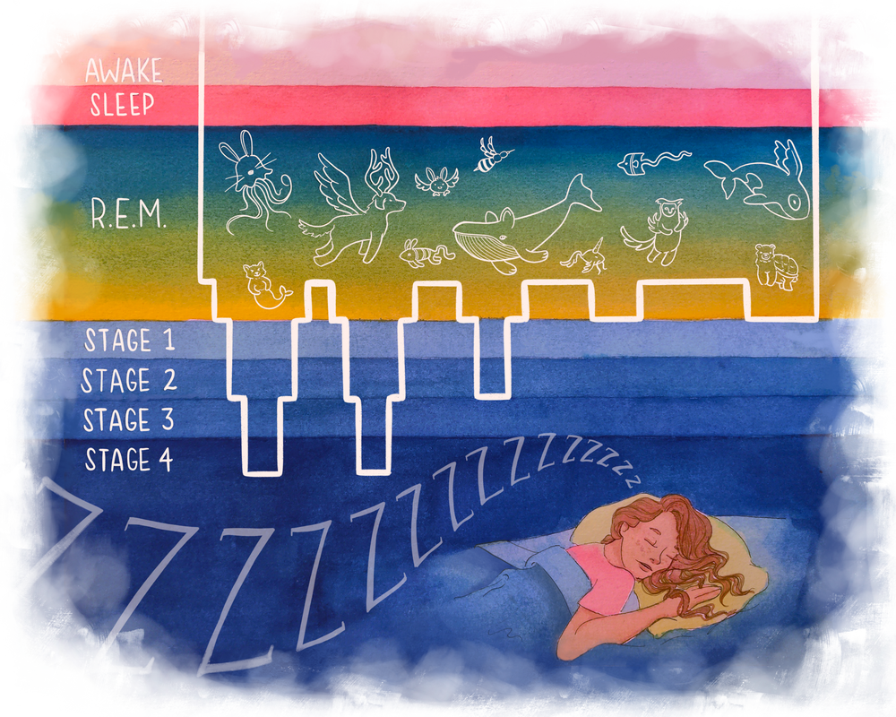
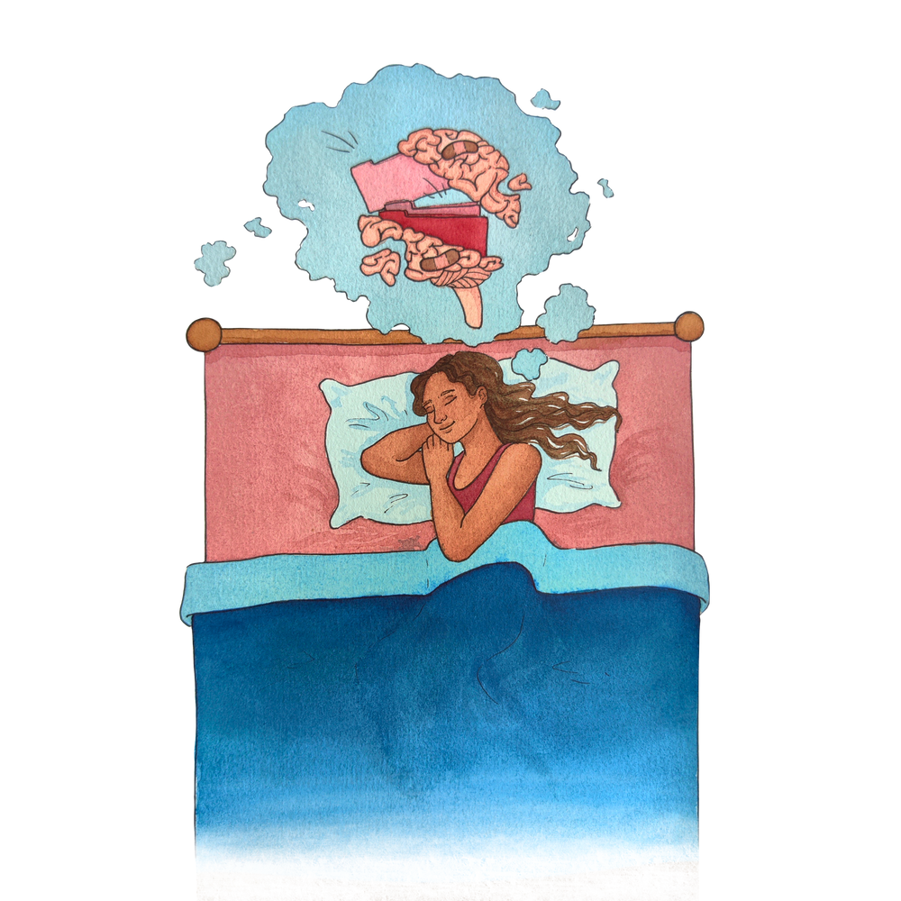

{}
Article originally published in [Issue 23 of Grey Matters Journal](https://greymattersjournal.org/pandemic-dreams/). Cited studies come from literature searches done in 2021, and may not be reflective of the most recent and up-to-date COVID-19 research.
{}

*Art by [Olivia D'Costa](https://greymattersjournal.org/author/olivia/).*

## Dreams Within a Fever Dream

When the world first entered lockdown at the end of March 2020, our lives were turned upside down. Days bled into nights spent inside the same walls, with no separation between work and home. If we went out, it was to a masked, nightmarish world full of empty streets and dark storefront windows. Even though we were cut off from one another and were no longer able to share physical time together that March, we were able to share the experience of a changing dreamscape.

Google searches for terms such as ‘covid dreams’, ‘vivid dreams covid’, and ‘coronavirus dreams,’ spiked by over fifty percent over the course of March and April 2020 [^1]. #QuarantineDreams trended on Twitter for the latter half of March and the majority of April 2020, with users posing questions such as ‘anyone else having really weird dreams in quarantine?’ or as one Twitter user eloquently put, ‘dude my dreams during quarantine...... SO weird lmao little brain u okay’ [^2].

These trends didn’t go unnoticed: public projects like [@CovidDreams](https://twitter.com/coviddreams?lang=en) and [idreamofcovid.com](https://www.idreamofcovid.com/) started to document the dreams people were having during quarantine. Sleep and dream specialists began to crowdsource dream data through several surveys online, encouraging people to describe any changes to their nightly sleep routines and the content of their dreams. One such study conducted by researchers in Italy found that not only did participants dream more frequently, the dreams they had were also longer, more vivid, bizarre, and emotional [^3]. This study, among many other research inquiries, confirmed the hypothesis we had been “sleeping” on: the pandemic hadn’t just made the world a living nightmare, it had infected our dreams as well. Further exploration provided researchers with greater insight into the biological connection between the pandemic and the changes people were experiencing to their sleep and dreams, but also allowed for a re-examination of existing hypotheses as to why humans dream.

## To Sleep, Perchance to Dream

To understand the various theories on why humans dream or what may influence our dream content, we must first understand the biological basis of sleep. The sleep-wake cycles of humans are naturally governed by the amount of daylight and the lack of daylight, night, an individual experiences. A particular class of retinal cells in the eye feed this information to a specialized part of the hypothalamus known as the suprachiasmatic nucleus (SCN) [^4]. The SCN uses this information about day and night length to coordinate the activity of body processes in a twenty-four hour cycle that corresponds to the hours of daylight we receive. With this synchronization, processes that characterize our waking state, such as muscle movement, coordination, and conscious awareness of ‘being awake’, are on during the day. Meanwhile, processes that characterize a state of sleep, such as muscle inhibition, a lack of sensory input, and most relevant to us, dreaming, are on at night when we are asleep. In other words, the SCN syncs up our circadian rhythms with the amount of daylight we normally experience [^4].

When the SCN receives light or dark input at times contrary to when our bodies are accustomed to being awake or asleep, biological processes become desynchronized. For example, a person can become hungry, more attentive, or sleepier at unusual hours of the day due to circadian regulation of certain hormones falling out of alignment with the hours of light perceived by the person’s SCN. This desynchronization is often termed jet lag. What we colloquially think of as jet lag is only one of many types of circadian rhythm sleep disorders. These disorders can be categorized into two forms: intrinsic and extrinsic. Intrinsic sleep disorders occur when the body is no longer able to set or synchronize its internal rhythms. Extrinsic sleep disorders, such as jet lag, occur when there is a disruption to the body’s circadian rhythm caused by changes to the external environment. Though it may not always manifest in individuals as a sleep disorder (‘disorder’ being characterized by disruptions to sleep that intrude on the normal functioning of an individual’s life), more often than not we are all subject to extrinsic disruptions to our circadian rhythms and experience a mismatch between our biological clocks and our external environment [^5]. Rather than being able to sleep when we’re sleepy, eat when we’re hungry, or otherwise follow the natural cycles set by our SCNs, we force ourselves into cycles defined not by sunlight, but by artificial light. We stay up late or wake ourselves up early for work or for other commitments we have to society. As a result, we experience irregular patterns of sleep: some sleep too much, some too little, and some experience disruptions to their sleep. On the whole, quality of sleep is poor [^5].

The worldwide shift into lockdown, disrupting people’s previously-existing work-life-sleep-family balance and forcing them to work from home and in social isolation, has provided researchers with the opportunity to investigate what happens when these cycles controlled by artificial light are altered. Two recent studies examined how this lockdown caused changes to people’s patterns of sleep, including sleep quality and sleep duration, as self-reported by study participants in sleep diaries or surveys. The first study assessed participants’ sleep patterns through two surveys, the first asking participants to retrospectively judge their sleep pre-lockdown, and the second concerned with participant’s sleep during lockdown [^5]. It also utilized a specialized questionnaire aimed at estimating the timing of each participant’s circadian clock. From this questionnaire, researchers were able to calculate a participants’ social jet lag by approximating the level of dyssynchrony between someone’s internal clock and their external environment. The study found that participants’ social jet lag was reduced, likely due to an associated increase in their sleep duration [^5]. The second study’s findings, conducted on university students, corroborated the first, and researchers discovered that sleep duration and sleep regularity of participants had increased during lockdown compared to baseline data from the same students, collected pre-quarantine [^6]. Researchers also found a non-intuitive correlation between social jet lag and sleep quality: even as social jet lag decreased and sleep duration increased, self-reported sleep quality decreased [^5]. The second study’s participants also slept later in the day than pre-pandemic [^6].

The combination of this increase in sleep duration and decrease in sleep quality is hypothesized to be a major factor underlying the increase in frequency and bizarreness of dreams that people have experienced during the lockdown [^7][^8]. In other words, changes to a person’s sleeping patterns or sleeping habits could also change the nature and frequency of their dreams. With quarantine, there have been widespread changes to people’s sleep patterns, the foremost being that people have been getting more sleep than our bodies are accustomed to. This abnormal increase in sleep is known as sleep extension, which has been found to be associated with higher dream recall [^9]. This could happen for at least two reasons:

Firstly, our improved dream recall after getting more sleep during the pandemic could simply be due to the nature of sleep and dreams. Sleep is split into stages that a person cycles through as they slumber. The stages consist of rapid-eye movement (REM) sleep, and the four stages of non-REM (nREM) sleep leading up to it [^10]. Although dreaming occurs in all stages of sleep, it primarily occurs in REM sleep. On a neurophysiological level, these stages are distinguishable through differences in patterns of brain activity. nREM sleep is characterized by slower waves of activity that spread intermittently throughout the brain from the thalamus, and REM sleep is characterized by patterns of brain activity similar to what brain activity looks like when we’re awake: faster and with regular waves of activity. Brain activity during REM sleep also involves activation of subcortical areas not active in nREM sleep. These subcortical areas are also involved in the formation and processing of memories. This may also explain why even though dreams occur in individuals in all stages of sleep, we are more likely to remember dreams when we have REM sleep. REM dreams, as described by their dreamers, are often the most vivid, action-packed, and fantastical. A sleeper must progress through the prior stages of sleep in a cyclical fashion to eventually reach REM sleep, a process that necessitates ninety minutes to two hours of time. The more an individual sleeps, the more REM sleep they will ultimately experience, and with more REM sleep comes the increased likelihood that the person will dream and remember their dreams upon waking [^11]. Since we’ve been sleeping more because of quarantine, we’ve been able to experience REM sleep, and thus we experience more vivid and memorable dreams.

The act of sleeping more also affects our ability to recall dreams in a more indirect fashion. Sleep extension functions as our body’s way of catching up on sleep ‘debt’ incurred by consistent sleep deprivation. Once this ‘debt’ has been repaid, however, if we continue to sleep for these longer periods of time, our sleep becomes less continuous. This extra sleep is characterized by much more frequent awakenings caused by the prolonged disconnect between our external and internal cycles of sleep and wakefulness. Studies show that sleep discontinuity on its own has been associated with increased dream recall [^11]. This increase is not necessarily due to participants dreaming more, but instead because the frequency of awakenings allows time for the brains of participants to encode the memories of each nREM dream they have, despite them not reaching REM sleep. In other words, under this hypothesis, for someone to be able to recall a dream, they need to be awake long enough for their mind to process the content of their dream and file away the memory into long-term storage [^11]. In the context of quarantine, this research explains why we are remembering our dreams more but the question remains: Why are we having more pandemic-related dreams?

## On The Interpretation of Dreams

While there is currently no consensus on why we need sleep or why we dream, the prevailing hypothesis is that both allow for the body to perform self-repair [^12]. It may be a stretch to think that the body of every animal undergoes enough damage in a day to warrant such regular self-repair. However, all animals undergo stress throughout the day, and through it, damage to body tissue. Sleep would be evolutionarily favorable as a break period meant to prevent damage from compounding the following day. Similarly, one of the main hypotheses as to the biological function of dreams is that they are a way for our brains to process and recover from stressful experiences from the day, and best prepare for related stressful situations in the future [^12]. Dreams, in this way, may help humans cope with reality, and may reflect the turmoil someone feels during a difficult period in their life.

Under this theory, it makes sense that as we humans collectively experience the stress of the COVID-19 pandemic, we experience equally upsetting dreams [^13][^14]. A network analysis of self-reported dream content collected from online surveys found that not only were two-thirds of the extracted dream clusters (clusters of dream descriptions formed by associations between words with similar meanings) related to bad dreams, more than half of these bad dream associated clusters were fraught with pandemic-specific troubles [^13]. These dream clusters were marked by themes of failures in social distancing or PPE, as well as a general fear of contagion or sense of existing in a dystopian or apocalyptic setting [^13]. Moreover, studies that broke down dreams by several other demographics found that certain groups had dreams with more negative emotional content at a higher rate than the general population [^14][^15]. These included groups of people one would assume to be under more stress due to the pandemic, such as workers out of jobs, or people who have relatives or friends who were affected by COVID-19 [^15]. A study using the control of normative pre-pandemic dreams and their content specifically found women to be disproportionately subject to more nightmares during the pandemic than before, with their nightmares characterized by more aggressive interactions with other people [^16]. Those who are subject to more stress because of traumatic events have also been found to experience these effects to a greater extent than the general population.

Changes in dreaming and sleep patterns after a population collectively undergoes a traumatic event is not an experience limited only to the pandemic. Previous studies have found decreases in sleep quality and increases in nightmares post-9/11 in the US, as well as after natural disasters such as earthquakes [^17][^18]. The assumption in all of these cases is that each event induced societal stress and trauma, or at the very least, extreme emotions. These emotions not only affect our minds when we’re awake, but also bleed into sleep and the content of our dreams. It's arguable whether this is a reflection of our conscious mental states, or our minds trying to work through the stress in the form of dreams while we rest our bodies. Regardless, the fact that the world has been experiencing nightmares at a higher rate does not bode well for our general mental health. The emotional content of our dreams affects our peace of mind and mood when we’re awake as well [^19]. If we experience vivid and disturbing pandemic-related dreams, we are bound to experience more pandemic and quarantine-related anxiety and stress while we’re awake. This could potentially cause long-term detriments to our overall mental health and well-being, such as increasing the risk or prevalence of depression and anxiety [^19].

## Sweet Dreams Aren’t Made of This

Isolation has made human interaction rare and brief, and in a way, our dreams are a natural reaction to this loss of human connection. While these nightmares may only bring us more stress, examining them more closely could perhaps help us better understand our individual emotional reactions to COVID-19 and what about it is bothering or scaring us most. And though we perhaps still can’t meet face to face, sharing these worries with others might help us maintain those fragile human connections, and help us bond even in this continued nightmare of a pandemic.

Additionally, as countries around the world begin to reopen, we are once again subject to changes to our sleep patterns as we re-adjust to normal life. As we go through this process, perhaps our dreams will change again to reflect our changing environments. Already, it seems that we’ve begun to dream not only about threats of infection or the stress of quarantine and social isolation, but also the uncertain hope that comes with being able to finally put parts of the pandemic in an era behind us [^16]. In the coming future, though perhaps we’ll have less at-home time to sleep and fewer vivid dreams, maybe we’ll be able to regain our sleep quality and return to our normal sleep patterns along with the rest of the cycles that make up our normal, pre-pandemic lives.  A preliminary study from Italy, as it begins to reopen, is hopeful in this regard [^20]. Not only did the prevalence of self-reported sleep problems significantly decrease during the last weeks of mandatory lockdown, one quarter of the population surveyed reported that their sleep quality improved a month after the end of lockdown. However, these improvements were not as great among people who were still exposed to news about the pandemic, or who still knew people affected by it [^20]. Yet as we continue to move forward in 2021, as more people are vaccinated, and as more countries are able to open up, hopefully we’ll all be able to wake up from the COVID-19 nightmare for good, and sleep better at night because of that.

### **Check out the rest of Issue 23 of Grey Matters Journal [here](https://greymattersjournal.org/tag/issue-23/)!**

[^1]: [Google Public Data](https://trends.google.com/trends/explore?date=2020-01-01%202021-01-01&geo=US&q=dreams%20during%20quarantine). Dreams during Quarantine. Google Trends Analysis. 16 May 2021.
[^2]: '@snitchery'. 2020, April 2. 'dude my dreams during quarantine...... SO weird lmao little brain u okay'. [Tweet](https://twitter.com/snitchery/status/1245740453691117569)
[^3]: [@CovidDreams](https://twitter.com/coviddreams?lang=en)
[^4]: [idreamofcovid.com](https://www.idreamofcovid.com/)
[^5]: Gorgoni, M., Scarpelli, S., Alfonsi, V., Annarumma, L., Cordone, S., Stravolo, S., & De Gennaro, L. (2021). Pandemic
    dreams: quantitative and qualitative features of the oneiric activity during the lockdown due to COVID-19 in Italy. Sleep medicine, 81, 20–32. Advance online publication. [https://doi.org/10.1016/j.sleep.2021.02.006](https://doi.org/10.1016/j.sleep.2021.02.006)
[^6]: Ghotbi, N., Pilz, L. K., Winnebeck, E. C., Vetter, C., Zerbini, G., Lenssen, D., Frighetto, G., Salamanca, M., Costa, R.,
     Montagnese, S., & Roenneberg, T. (2020). The µMCTQ: An Ultra-Short Version of the Munich ChronoType Questionnaire. Journal of biological rhythms, 35(1), 98–110. [https://doi.org/10.1177/0748730419886986](https://doi.org/10.1177/0748730419886986)
[^7]: Blume, C., Schmidt, M. H., & Cajochen, C. (2020). Effects of the COVID-19 lockdown on human sleep and rest-activity
     rhythms. Current biology : CB, 30(14), R795–R797. [https://doi.org/10.1016/j.cub.2020.06.021](https://doi.org/10.1016/j.cub.2020.06.021)
[^8]: Wright, K. P., Jr, Linton, S. K., Withrow, D., Casiraghi, L., Lanza, S. M., Iglesia, H., Vetter, C., & Depner, C. M.
    (2020). Sleep in university students prior to and during COVID-19 Stay-at-Home orders. Current biology : CB, 30(14), R797–R798. [https://doi.org/10.1016/j.cub.2020.06.022](https://doi.org/10.1016/j.cub.2020.06.022)
[^9]: Bottary, R., Simonelli, G., Cunningham, T. J., Kensinger, E. A., & Mantua, J. (2020). Sleep extension: an explanation for
     increased pandemic dream recall?. Sleep, 43(11), zsaa131. [https://doi.org/10.1093/sleep/zsaa131](https://doi.org/10.1093/sleep/zsaa131)
[^10]: Kocevska, D., Blanken, T. F., Van Someren, E., & Rösler, L. (2020). Sleep quality during the COVID-19 pandemic: not one
     size fits all. Sleep medicine, 76, 86–88. [https://doi.org/10.1016/j.sleep.2020.09.029](https://doi.org/10.1016/j.sleep.2020.09.029)
[^11]: van Wyk, M., Solms, M., & Lipinska, G. (2019). Increased Awakenings From Non-rapid Eye Movement Sleep Explain Differences
    in Dream Recall Frequency in Healthy Individuals. Frontiers in human neuroscience, 13, 370. [https://doi.org/10.3389/fnhum.2019.00370](https://doi.org/10.3389/fnhum.2019.00370)
[^12]: Capellini, I., Barton, R. A., McNamara, P., Preston, B. T., & Nunn, C. L. (2008). Phylogenetic analysis of the ecology and
    evolution of mammalian sleep. Evolution; international journal of organic evolution, 62(7), 1764–1776. [https://doi.org/10.1111/j.1558-5646.2008.00392.x](https://doi.org/10.1111/j.1558-5646.2008.00392.x)
[^13]: Pesonen, A. K., Lipsanen, J., Halonen, R., Elovainio, M., Sandman, N., Mäkelä, J. M., Antila, M., Béchard, D., Ollila, H.
    M., & Kuula, L. (2020). Pandemic Dreams: Network Analysis of Dream Content During the COVID-19 Lockdown. Frontiers in psychology, 11, 573961. [https://doi.org/10.3389/fpsyg.2020.573961](https://doi.org/10.3389/fpsyg.2020.573961)
[^14]: Kilius, E., Abbas, N. H., McKinnon, L., & Samson, D. R. (2021). Pandemic Nightmares: COVID-19 Lockdown Associated With 
    Increased Aggression in Female University Students' Dreams. Frontiers in psychology, 12, 644636. [https://doi.org/10.3389/fpsyg.2021.644636](https://doi.org/10.3389/fpsyg.2021.644636)
[^15]:Scarpelli, S., Alfonsi, V., Mangiaruga, A., Musetti, A., Quattropani, M. C., Lenzo, V., Freda, M. F., Lemmo, D., Vegni, E.,
    Borghi, L., Saita, E., Cattivelli, R., Castelnuovo, G., Plazzi, G., De Gennaro, L., & Franceschini, C. (2021). Pandemic nightmares: Effects on dream activity of the COVID-19 lockdown in Italy. Journal of sleep research, e13300. Advance online publication. [https://doi.org/10.1111/jsr.13300](https://doi.org/10.1111/jsr.13300)
[^16]: Barrett, D. (2020). Dreams about COVID-19 versus normative dreams: Trends by gender. Dreaming, 30(3), 216–221. 
    [https://doi.org/10.1037/drm0000149](https://doi.org/10.1037/drm0000149)
[^17]: Hartmann, E., & Brezler, T. (2008). A systematic change in dreams after 9/11/01. Sleep, 31(2), 213–218. 
    [https://doi.org/10.1093/sleep/31.2.213](https://doi.org/10.1093/sleep/31.2.213)
[^18]: Tempesta, D., Curcio, G., De Gennaro, L., & Ferrara, M. (2013). Long-term impact of earthquakes on sleep quality. 
    PloS one, 8(2), e55936. [https://doi.org/10.1371/journal.pone.0055936](https://doi.org/10.1371/journal.pone.0055936)
[^19]: Sikka, P., Pesonen, H. & Revonsuo, A (2018). Peace of mind and anxiety in the waking state are related to the affective
     content of dreams. Sci Rep 8, 12762. [https://doi.org/10.1038/s41598-018-30721-1](https://doi.org/10.1038/s41598-018-30721-1)
[^20]: Beck, F., Leger, D., Cortaredona, S., Verger, P., Peretti-Watel, P., & COCONEL group (2021). Would we recover better sleep
    at the end of Covid-19? A relative improvement observed at the population level with the end of the lockdown in France. Sleep medicine, 78, 115–119. [https://doi.org/10.1016/j.sleep.2020.11.029](https://doi.org/10.1016/j.sleep.2020.11.029)

