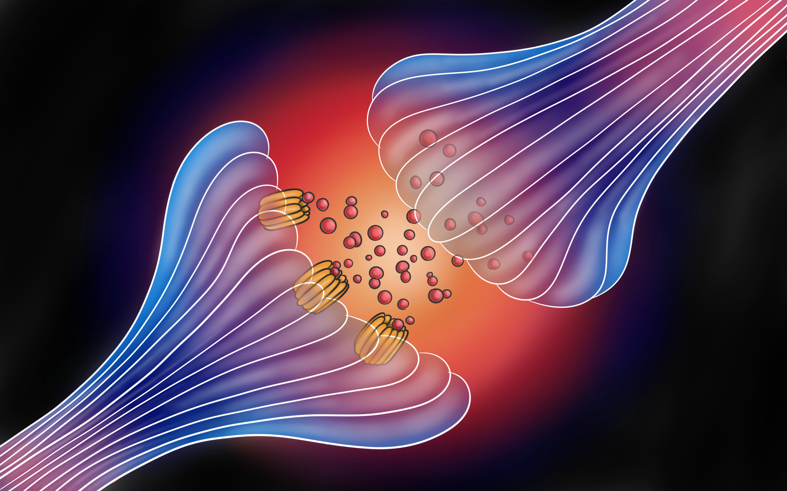

{}
Article originally published in [Issue 20 of Grey Matters Journal](https://greymattersjournal.org/how-a-signal-is-ampafied/).
{}

*Art by [Olivia D'Costa](https://greymattersjournal.org/author/olivia/).*

## Introduction

We've all heard of Pavlov's dog, the notorious dog that Ivan Pavlov conditioned in a series of experiments to salivate at the sound of a bell by repeatedly ringing the bell right before giving the dog its dinner [^1]. Pavlov's experiments on his dog were groundbreaking. They were the basis for a new theory of learning in psychology: associative learning or learning by forming connections between things and our responses to them. In the case of Pavlov's dog, the animal formed an association between the dinner bell and the dinner itself, learning that the bell signified dinner [^1]. Associations like these are present in our day-to-day lives: they're how we learn new things, and how our subconscious memory of these things outlasts their presence in our lives, like how you might reach for your phone when you hear something that sounds like your ringtone or how one might be reminded of an old friend when listening to a nostalgic song. [^1].

This reflects how our neurons work: as the saying goes, "neurons that fire together, wire together." Imagine three neurons in a pathway, with two giving inputs to the third, but one being much weaker than the other. These three neurons are analogous to the elements of Pavlov’s experiment. The neuron receiving the inputs represents the salivation, the neuron giving an input strong enough to trigger a response represents providing food, and the neuron giving an input too weak to trigger a response represents ringing the bell. If the two neurons fire together and are associated, then the response to both inputs will strengthen so that the neuron with the weaker input, the bell neuron, can trigger the response of the salivation neuron on its own as well. This phenomenon, known as synaptic plasticity, is how a neuron’s information processing abilities change based on how strong its synapses are [^2]. Though synaptic plasticity doesn’t always strengthen the connection between two neurons, both strong and weak connections between neurons are strengthened in our example. This means that the neurons in the pathway will have stronger responses to their stimulus. In the case of associative learning, pairing a weaker stimulus with a stronger stimulus strengthens the connection between the two input neurons and the neuron receiving the inputs.

But what's the molecular mechanism behind the association of multiple events on a neuronal level? Researchers have hypothesized that associative learning works because of the behavior of the NMDA receptor, a neuronal receptor with several unique characteristics. This receptor, and its effects on the expression of another receptor, the AMPA receptor, allows our brain to change our responses to specific events over time [^3]. This modification is reliant on synaptic plasticity, and its long-term effects on a neuron’s connections are thought to underlie processes of learning and memory. By studying the NMDA receptor and its effects on a neuron’s processing abilities, researchers have gained a better understanding of the biological mechanisms that allow us to learn and form memories [^3]. Not only does this bring researchers closer to finding the parts of our brain that store memory and create our identity and consciousness, but also provides new approaches to the treatment of neurological conditions that cause memory impairments.

## Molecular Mechanisms

One of the most important regions for understanding how communication between neurons changes is the space between them, called a synapse. While the detailed workings of this space is as intricate as it is interesting, its basic function is rather simple. It serves as a junction where one neuron, called the presynaptic neuron, sends chemical signals to a second neuron, called the postsynaptic neuron [^2]. These signals are in the form of molecules, called neurotransmitters, which diffuse across the space from the presynaptic neuron to the postsynaptic neuron where they bind to their respective receptors. Neurotransmitters, upon binding to their receptors, normally can trigger one of two responses: They can open an ion channel on the receptor, or they can trigger a signal cascade within the neuron that affects its longer term-firing abilities. Opening an ion channel allows positive or negative ions to flow into the postsynaptic cell, bringing it either closer to or further from firing an action potential. This is the basic mechanism by which signals are conveyed from neuron to neuron in a pathway. Triggering a signal cascade, however, doesn't always lead to the firing of an action potential. Instead, these signal cascades make it so that a neuron is more or less likely to fire an action potential. In other words, this response is how synaptic plasticity occurs, and how our neurons learn to respond differently to different stimuli, depending on how frequent or rare these stimuli are. Much like associative learning, the altered response to a stimuli lasts for longer than the stimuli is present. In this case, the time the neurotransmitter is present in the synapse is longer, and researchers believe these long-term effects of synaptic plasticity underlie how we remember things. At its most basic level, that is what a memory is to our neurons: the state a neuron is in after it’s been stimulated and hasn’t completely returned to normal. In other words, altering a neuron’s processing abilities via synaptic plasticity is what helps us remember and learn some things better than others. One of the biggest questions when it comes to synaptic plasticity is how does a neuron ‘know’ what synapses to strengthen and which to weaken. How can it tell which synapses trigger action potentials more often, and strengthen those, while weakening synapses that trigger action potentials less often?

The mechanism of the NMDA receptor provides a possible answer to both of those questions. As previously mentioned, the NMDA receptor is tied to our ability to associate the occurrence of two events. Researchers have hypothesized that its action provides a mechanism by which neurons can monitor which of its synapses are consistently receiving signals from the presynaptic neuron that are strong enough to fire an action potential. The same mechanism can be applied to weak signals that don’t manage to fire an action potential, and the neurons will strengthen and weaken synapses accordingly [^3]. In this way, neurons that fire together, wire together, but only if firing means firing an action potential. Moreover, if neurons don’t fire together, the chances of them firing together is reduced, as the connection between them is weakened.

This association is possible because of a specific property of the NMDA receptor. Two events must occur simultaneously for the NMDA receptor’s channel to open. First, glutamate must bind to the receptor for it to activate. However, the NMDA channel is normally blocked by magnesium ions [^4]. To completely open a channel, its magnesium block must also be removed by the neuron being depolarized in some other way, which can happen one of two ways. The first is the proposed cellular mechanism for associative learning, which occurs as follows. If the postsynaptic neuron just has NMDA receptors at that synapse, then the synapse is called a silent synapse. This is because the neuron in question doesn’t respond to the signal due to it still being blocked by magnesium ions. In this case, depolarization in the neuron caused by a signal from another, non-silent synapse can open the NMDA channels if it occurs when glutamate is already activating the receptors. The opening of the NMDA channels allows positive ions to flow in, further depolarizing the neuron. More importantly, calcium ions enter through the open NMDA channels. A large enough amount of calcium ions entering will trigger a signal cascade that increases expression of the gene coding for AMPA. AMPA, like NMDA, is a glutamate receptor, but the opening of its channel only requires the binding of glutamate. The signal cascade also tells the neuron to add the newly synthesized AMPA receptors to the synapse. However, this is all reliant on the concentration of calcium ions in the neuron. AMPA receptors will only be produced in greater amounts and added to the synapse if there’s a large enough increase in calcium concentration, which would normally only occur during an action potential. Therefore if an action potential results from the combination of NMDA receptors and previous depolarization consecutive times, the influx of calcium will eventually increase the number of functioning AMPA receptors at the previously silent synapse enough that it can function independently of the other synapse it had been activated in conjunction with [^4].

The second way that an NMDA channel's magnesium block can be removed involves a non-silent synapse. In this proposed mechanism, the synapse of interest contains both NMDA and some AMPA receptors [^4]. If glutamate binds to both NMDA and AMPA receptors on the postsynaptic neuron, then AMPA channels will open and depolarize the neuron. Just like we saw in associative learning, this depolarization will remove the magnesium block from NMDA channels and open them as well, since glutamate is already activating them, and the influx of calcium will trigger the addition of more AMPA receptors to the synapse. Adding more AMPA receptors to the synapse makes it more sensitive to transmitting signals in the future. In other words, the synapse is strengthened with use. This phenomenon is called long-term potentiation (LTP) [^5].

But after that first initial coincidence, if the resulting increased depolarization caused by NMDA channels opening isn’t large enough for the neuron to reach threshold and fire an action potential, the information from the previous neuron and the correlation of these two events is lost [^5]. Worse, the synapse in question suffers from NMDA channels opening but not making the neuron positive enough to fire an action potential. The small influx of calcium ions into the neuron triggers the removal of already existing AMPA receptors at that synapse, making it weaker and less sensitive to stimulation from the presynaptic neuron. This phenomenon is called long-term depression (LTD). LTD works opposite to the common saying, “if at first you don’t succeed, try, try again.” Trying and failing to fire an action potential will punish a synapse more than not trying at all [^5]. And to a certain extent, we mirror our neurons. A near-victory is more crushing than if we didn’t think we had a chance from the start.

## Applications + Current Research

One region of the brain where synaptic plasticity, particularly LTP, is prevalent is the hippocampus. This part of the brain is essential to learning and memory, which suggests along with other evidence an association between LTP and memory. Synaptic plasticity declines with age, which researchers believe is the major cause of cognitive changes associated with aging [^6]. The foremost of these cognitive changes in the elderly is memory decline and a decline in the ability to learn new tasks. Because of the NMDA receptor’s role in learning and memory formation, researchers believe that these declines are caused by a change to the NMDA receptor’s properties or its expression. Specifically, researchers hypothesize that memory decline is tied to a decreased ability of neurons to undergo LTP, though it’s unknown how aging causes this on a molecular level [^6]. In trying to understand the effect of age on LTP and synaptic plasticity, researchers have found that similar to cognitive decline through aging in general, the cognitive decline in Alzheimer’s patients is tied to the NMDA receptor’s synaptic plasticity. Recent studies indicate that synapses affected by Alzheimer’s Disease are deficient in LTP [^7]. In other words, the neurons of Alzheimer’s patients are unable to strengthen their synapses through the NMDA-AMPA receptor system. Because of this finding, researchers are exploring treatments for memory decline with age and Alzheimer’s that target the NMDA receptor and increase the occurrence of LTP [^7]. Possibilities range from interventions as simple as getting more exercise to delay the onset of age-related memory impairment, to more complex molecular therapies that increase NMDA receptor activity and the frequency of LTP both directly and indirectly [^8].

Direct interventions involve administering drugs similar to glutamate. These drug molecules bind to NMDA receptors and interact with them in the same way glutamate does, promoting their opening activity and increasing the likelihood that LTP occurs at the synapse.  Increasing NMDA activity means that the receptors’ ion channels at a synapse are open more often, bringing the postsynaptic neuron closer to firing an action potential. As previously mentioned, firing an action potential will enhance future signals through the synapse through LTP. In this way, even if there’s less LTP occurring than normal because of deficits due to aging or Alzheimer’s, a direct intervention would increase the activation of NMDA receptors, and thus trigger the occurrence of more LTP [^9]. Some examples of drugs that do this include chemicals similar to glutamate, such as aspartate. However, as these directly activate NMDA receptors, if administered incorrectly or not localized to the hippocampus (or area of interest), there are potential side effects of too much LTP, a problem thought to underlie other neurodegenerative conditions [^9].

In contrast, indirect interventions involve targeting proteins and molecules that moderate NMDA activity, rather than targeting the NMDA receptor itself. The main ways this can occur is by decreasing activity of proteins or enzymes that normally inhibit NMDA activity or by increasing activity of proteins or enzymes that normally promote NMDA activity [^7]. Since researchers still don’t know how exactly LTP is decreased in aging or Alzheimer’s, testing indirect interventions will give them greater insight on how this deficit occurs. Specifically, it will give information on whether the primary cause is the NMDA receptor, one of the NMDA receptor’s regulatory enzymes, or farther downstream in the NMDA signaling cascade. Knowing how the decline in LTP arises on a cellular level will give researchers a better idea of what specific drugs should be tested as treatments bring them a step closer to treating diseases like Alzheimer’s and slowing the decline of memory with age.

## Conclusion

Even with further insights on the NMDA receptor, researchers are still a frustrating distance from answering the question of what exactly stores memory in our brains. Is memory simply created by the strengthening and weakening of synapses in different neural pathways, and the lasting changes this creates in how we process information? How does the changing of a neuron's pattern of activity become our experience, and our recall of that experience? Researchers are still searching for answers to these questions. Though researchers can’t yet fully answer the bigger questions, it’s important to keep in mind how this research has aided in the exploration of new interventions for age and Alzheimer’s related memory decline.

Applications of research from studying the NMDA receptor system have been integral to developing different treatments for cognitive declines caused by decreased synaptic plasticity. Treatments for memory decline due to aging and Alzheimer’s in particular have been targeted at increasing LTP in areas of the brain related to memory. While these interventions haven’t yet been tested extensively on patients, researchers hope they will eventually be able to be widely used in patients to improve their condition and quality of life by alleviating some of the causes of their memory loss, if not solving it completely. With greater insights into systems of synaptic plasticity similar to the NMDA receptor system, researchers hope to gain a better understanding of memory formation and  use that knowledge to eventually develop cures for Alzheimer’s and memory deficits caused by age.

### **Check out the rest of Issue 20 of Grey Matters Journal [here](https://greymattersjournal.org/tag/issue-20/)!**

[^1]: Maia TV. (2009) Reinforcement learning, conditioning, and the brain: successes and challenges. Cogn Affect Behav Neurosci.
     2009 Dec;9(4):343-64. doi: 10.3758/CABN.9.4.343.
[^2]: Morris RG (2013). NMDA Receptors and memory encoding. Neuropharmacology. 2013 Nov;74:32-40. 
    doi: 10.1016/j.neuropharm.2013.04.014. Epub 2013 Apr 27.
[^3]: Mukherjee B, Harley CW, Yuan Q.(2017). Learning-Induced Metaplasticity? Associative Training for Early Odor Preference
    Learning Down-Regulates Synapse-Specific NMDA Receptors via mGluR and Calcineurin Activation. Cereb Cortex. 2017 Jan 1;27(1):616-624. doi: 10.1093/cercor/bhv256.
[^4]: Volianskis A, France G, Jensen MS, Bortolotto ZA, Jane DE, Collingridge GL. (2015) Long-term potentiation and the role of
    N-methyl-D-aspartate receptors. Brain Res. 2015 Sep 24;1621:5-16. doi: 10.1016/j.brainres.2015.01.016. Epub 2015 Jan 22.
[^5]: Vadakkan KI (2019). A potential mechanism for first-person internal sensation of memory provides evidence for the 
    relationship between learning and LTP induction. Behavioural Brain Research, Volume 360, 15 March 2019, Pages 16-35. [https://doi.org/10.1016/j.bbr.2018.11.038](https://doi.org/10.1016/j.bbr.2018.11.038)
[^6]: Gray DT, Barnes CA. DISTINGUISHING ADAPTIVE PLASTICITY FROM VULNERABILITY IN THE AGING HIPPOCAMPUS. Neuroscience. 
    Volume 309, 19 November 2015, Pages 17-28
[^7]: Prieto GA, Trieu BH, Dang CT, Bilousova T, Gylys KH, Berchtold NC, Lynch G, Cotman CW. Pharmacological Rescue of Long-Term
    Potentiation in Alzheimer Diseased Synapses. Journal of Neuroscience 1 February 2017, 37 (5) 1197-1212; DOI: 10.1523/JNEUROSCI.2774-16.2016
[^8]: Tsai SF, Ku NW, Wang TF, Yang YH, Shih YH, Wu SY, Lee CW, Yu M, Yang TT, Kuo YM. Long-Term Moderate Exercise Rescues 
    Age-Related Decline in Hippocampal Neuronal Complexity and Memory. Gerontology. 2018;64(6):551-561. doi: 10.1159/000488589. Epub 2018 May 7.sciencedirect.com/science/article/pii/S0960982218316531
[^9]: Eslami M, Sadeghi B, Goshadrou F.Hippocampus. Chronic ghrelin administration restores hippocampal long-term potentiation
    and ameliorates memory impairment in rat model of Alzheimer's disease. 2018 Oct;28(10):724-734. doi: 10.1002/hipo.23002. Epub 2018 Sep 5.

