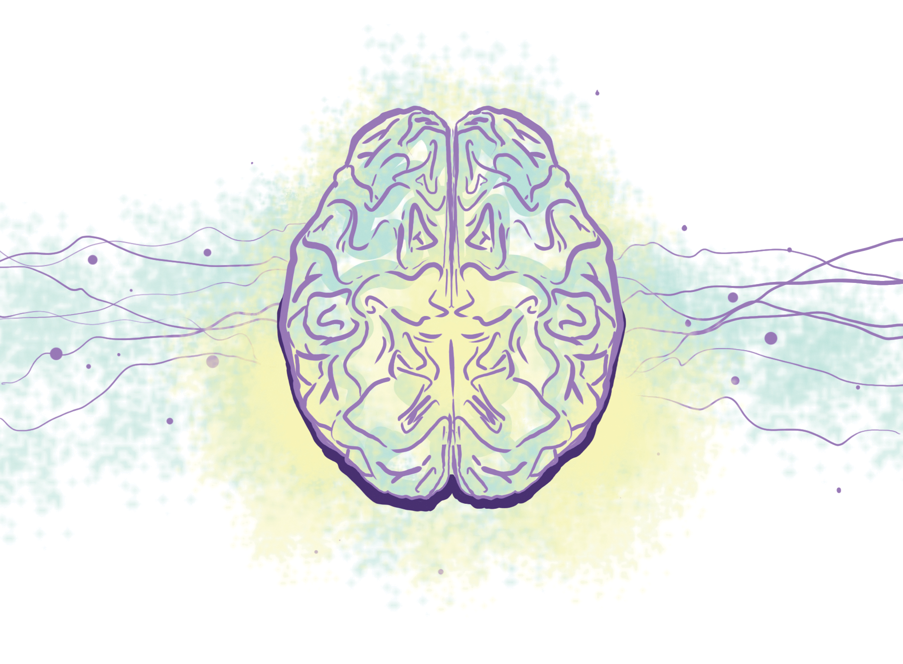

{}
    Article originally published in [Issue 18 of Grey Matters Journal](https://greymattersjournal.org/stimulating-developments-in-parkinsons-treatment/).
{}

*Art by [Angelique Guina](https://greymattersjournal.org/author/angelique/).*

Imagine you’ve been diagnosed with Parkinson’s disease. The symptoms start as a small shake in one of your hands, which gradually spreads and worsens [1]. You attribute it to old age, but over time, you begin to have trouble with even basic actions, like taking out your wallet, or dressing and feeding yourself. You also develop a stiffness in your limbs, which makes it harder and harder to move. You struggle with standing up and have trouble nodding your head. As the disease progresses, you have to rely on your friends and family for care and support, but even that becomes difficult [1].

These motor impairments, along with mental and behavioral changes characteristic to Parkinson’s disease, are mainly caused by the death of neurons that make dopamine [2]. Dopamine is a neurotransmitter. Neurotransmitters are chemical signals that pass from an excited neuron to neurons it synapses onto. Depending on the type of neurotransmitters the receiving neurons may be excited or inhibited. Dopamine is involved in the synapses of neurons essential to movement, reward-based learning and motivation, and executive function, and depending on context may be excitatory or inhibitory [2]. The death of these neurons, along with the resulting decrease in dopamine production and mistakes in protein folding, produces abnormal, disorganized neural activity [3]. Most treatments have mainly been targeted at replenishing dopamine in Parkinson’s patients to account for the disease’s motor and behavioral symptoms. One treatment in particular, deep brain stimulation (DBS), is focused on correcting the abnormal activity of neurons that normally receive dopamine.

The main treatment for Parkinson’s is levodopa, a chemical compound that is a precursor to dopamine [4]. Once it’s absorbed into nervous cells, it’s converted into dopamine, and can thus reduce symptoms of Parkinson’s caused by a lack of dopamine [4].

A prescription for levodopa or a similar drug is normally enough to relieve most of Parkinson’s worst symptoms so that many patients are able to live everyday lives. However, some people with Parkinson’s don’t respond well to the medications. Taking levodopa as a long-term dopamine-replacement therapy can have serious side effects, including increased restlessness, impulsiveness, and aggression [5]. These side effects resemble effects of addiction to drugs such as cocaine, and researchers are concerned that dopamine-replacement drugs may be addictive [5). This is particularly worrying for Parkinson’s patients, whose dosage must increase as the disease progresses and more dopamine-producing neurons die, increasing their susceptibility to addiction. In other words dosage must be increased to target a decreasing population of neurons

DBS is a fairly recent development in the treatment of Parkinson’s disease. It’s normally recommended to Parkinson’s patients only if they aren’t responding well to drug therapies like levodopa. DBS involves electrodes placed in specific areas of the brain where electrical stimulation has been shown to help manage Parkinson’s symptoms [7]. Surgeons manipulate the placement of the electrodes to find the orientation that decreases symptoms while minimizing any side effects. These implanted electrodes stimulate nearby neurons by sending an electrical signal, potentially causing an action potential. The neuron’s response can be modulated by the frequency or the pulse width of the electrical signal, which  changes the amount of charge per unit time. Adjusting the electrical signal allows for a highly individualized and flexible treatment approach. In other words, different Parkinson’s patients will have their neurons wired in slightly different ways, both dependent on the extent of the disease, and genetic differences from patient to patient.

However, the exact mechanism behind the relief from DBS is still unknown [7]. What we do know is that it somehow helps the neurons that normally receive dopamine, which fire more or less frequently than normal when this input is disrupted by disease progress [8]. The stimulation from the DBS electrode seems to inhibit neurons that are firing more frequently than normal and seems to excite neurons that are firing less frequently than normal [8].

Despite the fact that we don’t know the details of the mechanism behind DBS, it’s surprisingly effective at alleviating symptoms of Parkinson’s. A 2019 retrospective study from Pennsylvania Hospital that surveyed their first 400 DBS patients with Parkinson’s found that of those who received the surgery, 92.5% were happy with their treatment, 95% would recommend it, and 75% felt it provided control over their symptoms [6]. As a whole, patients reported an improved quality of life of those surveyed improved over when they were taking Parkinson’s drugs [6].

A major drawback of deep brain stimulation is that not all Parkinson’s patients qualify for the treatment. Surgical centers must assess candidates through a standardized process, including an MRI and a psychiatric consultation [9].  Factors normally considered in selection include how long a patient has had Parkinson’s, how responsive they are to their drug therapy, how old they are, and how much the disease has progressed. However, not all selection criteria are standardized, and new research is changing sections of this process. Age is one criterion that is hotly debated, with some studies using an age limit of 70 or 75 years rather than the clinical standard, which is around 50-60 years old. This is likely due to the fact there are several conflicting results from studies on the correlation between the clinical outcome of deep brain stimulation and age. Clinics normally have an age limit closer to 50 to err on the side of caution, but the exact age varies from clinic to clinic. Another debate is how long a patient should have a Parkinson’s diagnosis before receiving a DBS implant. If a patient hasn’t been diagnosed with Parkinson’s for very long, there’s a chance they could have been misdiagnosed and shouldn’t be undergoing such an intensive and invasive surgery that may be unnecessary or ineffective. Even if the patient does have Parkinson’s, many doctors consider it too risky to try operating so early in the progression of their disease. There are anti-Parkinson’s drugs that can be prescribed to patients who haven’t had Parkinson’s for as long. These patients have less pronounced symptoms, and the administration of drugs likely could result in a similar improvement of motor control. As a result, doctors normally don’t recommend patients for DBS until it’s clear they aren’t responsive to these drugs. Doctors don’t want to risk neurological damage because of a mistake during the surgery, which is notoriously difficult when less invasive treatment options exist [9]. Because of these risks, it’s important for surgical centers and doctors to have a more standardized protocol by which they select patients for the treatment, operate on them, and program the implant (based on the patient).

Another major concern about DBS is off-target side effects. There have been several case studies and reports of extreme psychiatric disturbances, including aggressive, risk-seeking behavior, and even suicide ideation and suicide in DBS patients [10]. However, there hasn’t been evidence directly linking DBS to suicide and suicide ideation. For many patients exhibiting aggressive or risk-seeking behavior, these behavioral changes have been remedied by simply reducing the amount of stimulation, or turning off the implant completely. For less serious cases, simply shifting the placement of electrodes serves to lessen these side effects [10].

Even with these drawbacks, you find though your other motor symptoms have remained about the same, your tremor has improved greatly [6]. You are able to do everyday activities, much like you could while taking levodopa, but you don’t suffer from the same side effects to your mood, and as a result, you feel much happier [10]. While DBS may not cure Parkinson’s or replace the dead dopamine producing neurons, it alleviates some of your symptoms, improving your quality of life, and may even slow the progression of the disease in your body. But that doesn’t mean there isn’t still hope for you, and other Parkinson’s patients.

Though deep brain stimulation is not intended to cure Parkinson’s, by learning more about how the stimulation functions, we can further refine the process,and gain insight into the pathology of Parkinson’s. If we can better understand how stimulation relieves symptoms on a systems level, we can understand how Parkinson’s creates these symptoms to begin with on a large scale. This way, research focused both on improving the precision of deep brain stimulation treatments and research into cures for Parkinson’s disease and other movement-based disorders can be conducted simultaneously. In fact, as technology progresses and researchers discover new groundbreaking treatments for Parkinson’s and other movement-related diseases, the need for deep brain stimulation will likely decline. This, of course, isn’t to say that deep brain stimulation doesn’t already have a great positive impact on the lives of Parkinson’s patients– it does, making life more livable and enjoyable for many Parkinson’s patients, allowing them to do simple, everyday tasks – from signing their name, shaving, carrying things around, and much more. Even if deep brain stimulation isn’t a lightning bolt cure to Parkinson’s, it’s still a stimulating development in the field of neuroscience that’s shockingly improved the quality of many Parkinson’s patients’ lives.

### **Check out the rest of Issue 18 of Grey Matters Journal [here](https://greymattersjournal.org/tag/issue-18/)!**

## References

[^1]: Parkinson’s Disease (2017, May 16). National Institute on Aging. [https://www.nia.nih.gov/health/parkinsons-disease]
    (https://www.nia.nih.gov/health/parkinsons-disease).
[^2]: Alcaro, A., Huber, R., & Panksepp, J. (2007). Behavioral functions of the mesolimbic dopaminergic system: an affective
    neuroethological perspective. Brain research reviews , 56 (2), 283–321. [doi:10.1016/j.brainresrev.2007.07.014](https://www.ncbi.nlm.nih.gov/pmc/articles/PMC2238694/)
[^3]: Hartmann, C. J., Fliegen, S., Groiss, S. J., Wojtecki, L., & Schnitzler, A. (2019). An update on best practice of deep 
    brain stimulation in Parkinson’s disease. Therapeutic Advances in Neurological Disorders. [https://doi.org/10.1177/1756286419838096](https://journals.sagepub.com/doi/10.1177/1756286419838096)
[^4]: Gandhi KR, Saadabadi A. Levodopa (L-Dopa) [Updated 2019 Mar 21]. In: StatPearls [Internet]. Treasure Island (FL):
     StatPearls Publishing; 2019 Jan-. [Available online](https://www.ncbi.nlm.nih.gov/books/NBK482140/)
[^5]: Lawrence AD, Evans AH, Lees AJ (2003). Compulsive use of dopamine replacement therapy in Parkinson’s disease: reward 
    systems gone awry? The Lancet: Neurology , 2(10), 595-604. [doi:10.1016/S1474-4422(03)00529-5](https://www.sciencedirect.com/science/article/pii/S1474442203005295?via%3Dihub)
[^6]: Hitti FL, Ramayya AG, McShane BJ, Yang AI, Vaughan KA, Baltuch GH (2019). Long-term outcomes following deep brain 
    stimulation for Parkinson’s disease. Journal of Neurosurgery, 1-6, [epub ahead of print]. [doi: 10.3171/2018.8.JNS182081] (https://thejns.org/view/journals/j-neurosurg/aop/article-10.3171-2018.8.JNS182081.xml?tab_body=fullText)
[^7]: Herrington TM, Cheng JJ, Eskandar EN (2016). Mechanisms of deep brain stimulation. Journal of Neurophysiology , 115(1)
    :19-38. [doi: 10.1152/jn.00281.2015.] (https://www.physiology.org/doi/full/10.1152/jn.00281.2015)
[^8]: Ashkan, K., Rogers, P., Bergman, H. et al. Insights into the mechanisms of deep brain stimulation. Nat Rev Neurol 13, 548–554 (2017).
    [https://doi.org/10.1038/nrneurol.2017.105](https://doi.org/10.1038/nrneurol.2017.105)
[^9]: Elena Moro & Anthony E Lang (2006) Criteria for deep-brain stimulation in Parkinson’s disease: review and analysis, Expert Review of Neurotherapeutics, 6:11, 
    1695-1705, [DOI: 10.1586/14737175.6.11.1695](https://www.tandfonline.com/doi/full/10.1586/14737175.6.11.1695).
[^10]: Schupbach WMM, Chastan N, Welter ML et al. Stimulation of the subthalamic nucleus in Parkinson’s disease: a 5-year follow up. J. Neurol. Neurosurg. Psychiatr.
     76, 1640–1644 (2005).
