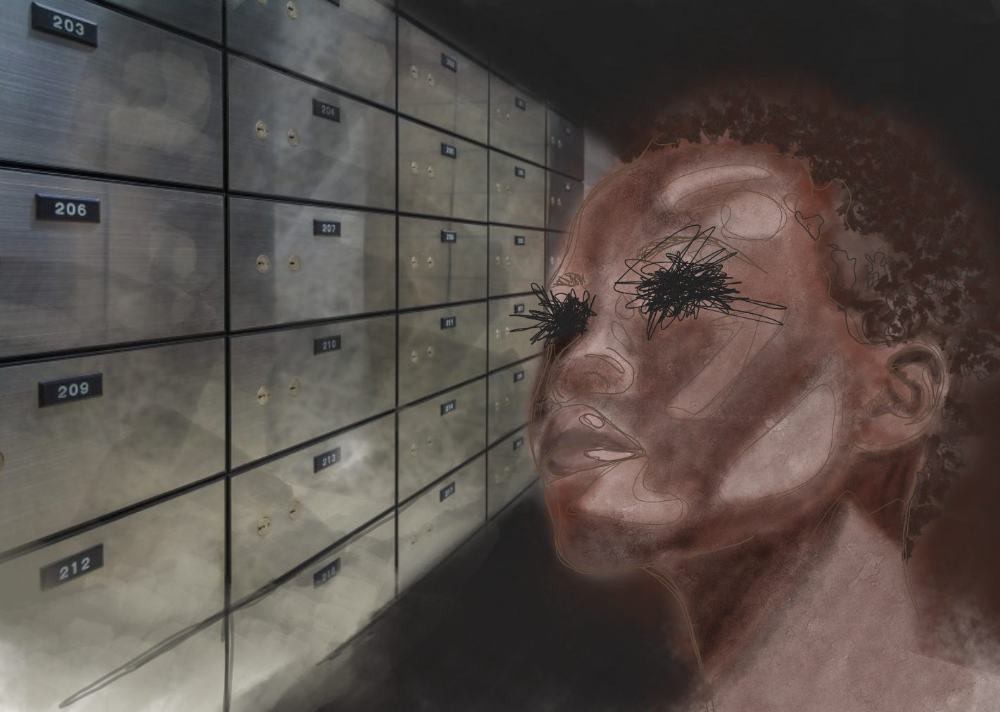
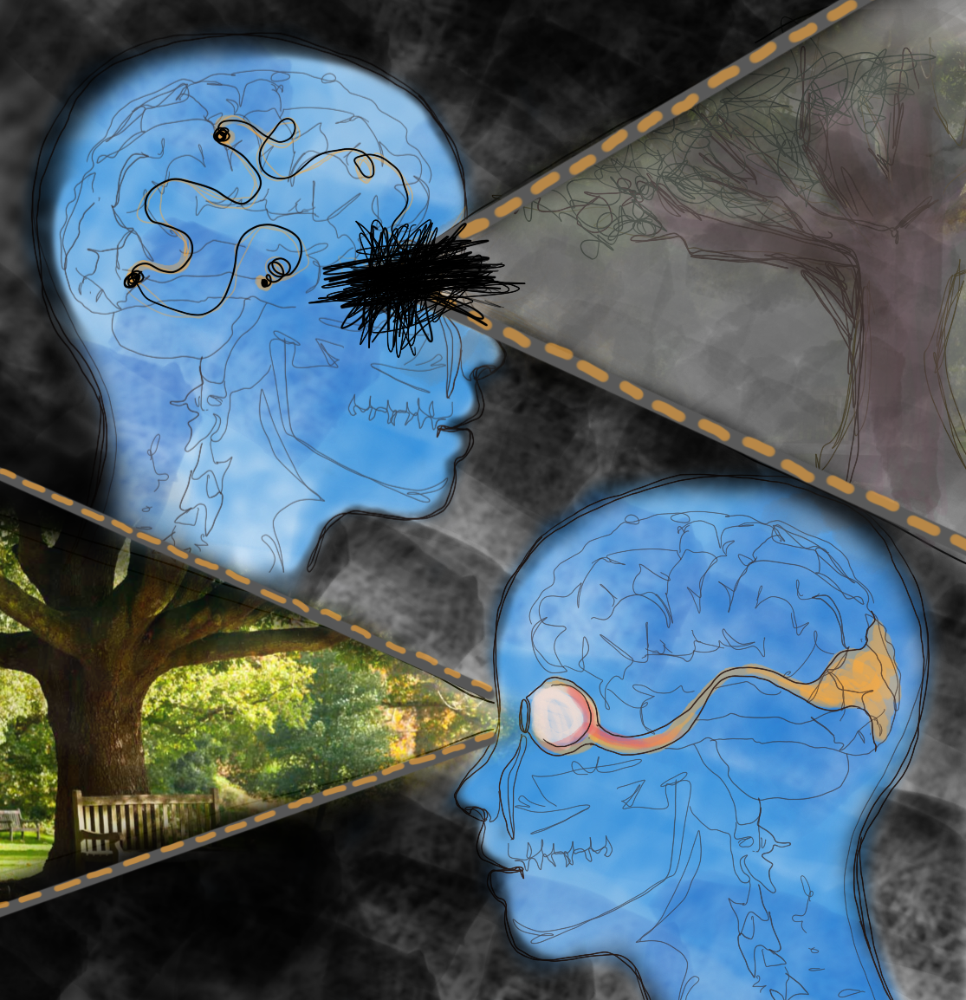
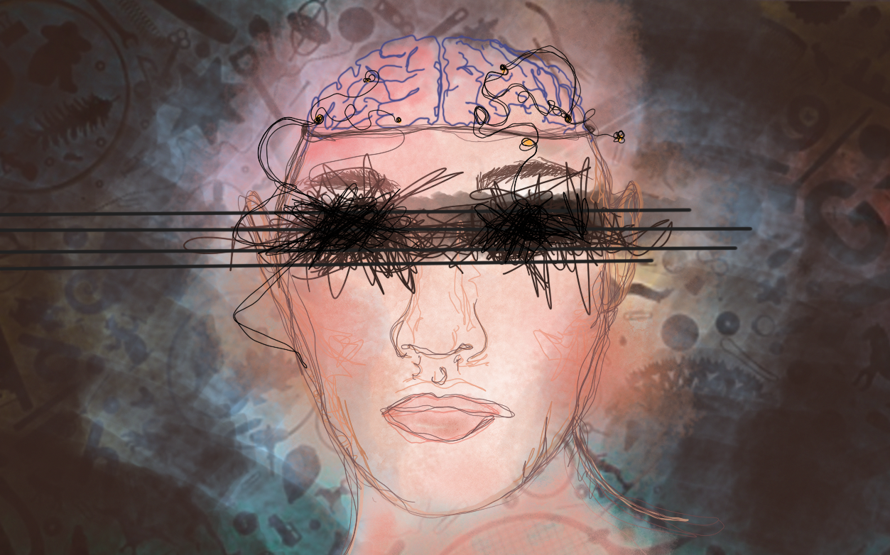

{}
Article originally published in [Issue 19 of Grey Matters Journal](https://greymattersjournal.org/to-see-or-not-to-see/).
{}

*Art by [Kayrina Bui](https://greymattersjournal.org/author/kayrina/).*

The year was 1998 and a blind woman had done the seemingly impossible: she had managed to accurately post a letter in a constantly rotating mail slot. By all accounts, she was blind. She couldn’t go about daily life without her cane or a guide telling her where things were. But somehow, she was able to ‘see’ that mail slot in a strange, not fully conscious way. Before this moment, she’d never realized that she could still see, in a way, while blind. It was only after being asked to perform these tasks for an experiment that she realized she had such a mysterious ability [^1].

Her ability had been observed in others before, but had mainly been attributed to a sort of ‘sixth sense’ or ‘phantom sight’ following an injury causing blindness. Only recently has this ability been recognized as a scientific phenomenon, aptly named “blindsight.” Blindsight is as much of a paradox as its name. It describes the ability of those who are blind to pinpoint and respond to objects in their field of vision [^2]. Blindsight sometimes occurs in people who are fully blind as well as those who have damage to either the left or right side of their field of vision [^2]. In other words, it’s a ‘sight’ that’s unique to certain blind people and uses a different part of the brain than involved in what we typically think of as vision.

Researchers have clarified the definition of blindsight into two different categories: type I and type II blindsight [^2]. In type I blindsight, patients can physically locate objects, but don’t consciously know where they are. In type II blindsight, patients have a sort of ‘sixth sense’ about where an object is and can physically locate it. Like the general term for blindsight, however, the patient is unable to see normally in both types, and these abilities are outside of what we would usually consider possible for a blind person [^2]. The underlying cause of both types of blindsight is the same, they just experience it in a slightly different way.

Researchers observed how well people with blindsight could perform tasks to try and get a better understanding of how this different ‘sight’ was expressed, as well as how it was perceived by the patients themselves. They’re still trying to figure out the extent of abilities this different ‘sight’ gives people. When choosing patients for studies, it made a good comparison for researchers to use people with blindness on only one side. Blindsight patients who have damage to only one side of their visual field have been able to respond to movement in their blind field of vision with the same accuracy and speed as when they were using their normal vision [^3]. Patients were also able to pick up objects silently placed in front of them on their first try [^4]. A study even showed that a man with blindsight could navigate a crowded hallway without bumping into a single thing, despite not being allowed to use his cane [^5].

To figure out what created the behaviors exhibited in blindsight, researchers had to first determine if there was a specific region of the brain injured in blindsight that all blindsight patients shared. To do this, they first studied monkeys who exhibited behaviors that researchers hypothesized were due to blindsight [^6]. One such monkey, who had her entire primary visual cortex removed, could navigate a brand new habitat as easily as monkeys who weren’t blind. She could also find and locate food just as easily as other monkeys, despite not being able to see. These behaviors weren’t apparent in monkeys who were blind because of damage to or removal of different parts of the visual pathway from the retina to the primary visual cortex, so researchers concluded that blindsight only occurred in patients with damage to their primary visual cortex [^6].

With this discovery and the invention and application of more advanced brain imaging technology such as fMRI to blindsight research, researchers were able to focus on exploring various mechanisms by which blindsight could occur. fMRI measures the oxygen levels of blood in the brain [^3]. By looking at which parts of the brain have the highest blood oxygen levels while we do certain tasks, researchers can figure out which parts of the brain are activated to complete those tasks. Through fMRI and similar technology, researchers have learned that the primary visual cortex is essential in helping us see by processing what we’re seeing, so damage or loss of processing ability affects the field of vision corresponding to the region damaged. Varying levels of damage will result in varying levels of visual ability. Damage to the left visual cortex would decrease someone’s ability to see on their right side, and damage to the right visual cortex would decrease someone’s ability to see on their left side. This is because the “wiring” of the visual pathway from the retina to the primary visual cortex is crossed [^3].

fMRI has also helped researchers realize that vision doesn’t operate simply through this one visual pathway. When your primary visual cortex is damaged, your eyes still intake information from your surroundings and send signals to other, undamaged parts of your brain, even if you can’t process it as a cohesive image. Only your conscious awareness of being able to see is damaged. For example, recognizing colors, shapes and faces are processed in different areas of the brain, and the activity of these regions are unaffected when the primary visual cortex is damaged [^2]. This is evident in affective blindsight, a form of blindsight where the patient is still able to recognize emotions on faces despite not being able to see [^7]. This is similar to how you may not be able to see anything on your phone screen if you break it, but your phone still works if you replace the screen-- only the screen itself is broken, the rest of the phone is fine.

Researchers have been able to pinpoint the possible parts of the brain involved in blindsight that compensate for loss of vision. By using fMRI to analyze the brain activity of patients who are blind and exhibiting blindsight on only one side of their field of vision, researchers were able to single out parts of the brain used in the hemisphere experiencing the blindsight that weren’t used in the other hemisphere’s normal visual processing [^3]. It was found that the brain compensated for the damaged regions by activating areas not normally used for this task on both sides of the primary visual cortex and even other areas of the brain [^3].

This evidence has given rise to several theories as to how blindsight occurs. Researchers originally considered the possibility that blindsight was caused by the undamaged regions of the cortex still functioning as normal, causing some form of vision to still be present [^7]. This hypothesis has lost credibility, however, as researchers have observed blindsight in patients with total primary visual cortex loss. This also rules out the possibility that the brain compensates for the damage in the primary visual cortex on one side of the brain by rerouting some visual detection pathways to the visual cortex on the other side of the brain [^3].

This visual information could also be from subcortical regions of the brain [^3]. These other regions of the brain are a part of pathways involved in visual processing, though not as directly as the primary visual cortex. These secondary pathways are present in normal vision as well, but the extent of their role in vision is masked by the conscious part of vision that requires the primary visual cortex to be intact. The damage to the primary visual cortex also may have triggered increased usage of these secondary visual pathways to compensate for decreased visual ability, as the brain reroutes the signals [^3]. In other words, the damage to the visual cortex only affects a blindsight patient’s conscious awareness of seeing, but other parts of vision processed by different parts of the brain are still present and processed, perhaps at a higher rate than normal because we can still see and react to things.

Blindsight could be an example of the brain and nervous system’s ability to correct or account for loss of vision. Better understanding blindsight is improving our understanding of vision and perception, and marks a hopeful starting point for the development of therapies for the visually impaired. Researchers hypothesize that the visual processing of blindsight patients can be improved if they’re more aware of their ‘sixth sense’, improving their quality of life [^8]. One such method would involve programs designed to emphasize the visual ability that blindsight gives patients that they might not be as aware of or used to using. These programs would involve a patient searching for and responding to an object on their blind side as quickly as possible, with the hope that the patient learns to train more attention on their blind side, and thus better be able to recognize stimuli on that side when presented to them. Another method involves utilizing the other functions of the regions of the brain thought to be involved in blindsight. For example, other pathways through nuclei in a subcortical region of the brain are involved in encoding sensory information from all senses, not just vision [^9]. Researchers hypothesize that coupling visual information with information from another, fully functioning sense will allow visual information to be processed at a higher capacity than on its own [^8]. Using both senses at the same time enhances visual processing ability, like using subtitles to watch a movie, where we see and hear the same thing at the same time, focusing our attention on the words, and improving our response to it. While these programs don’t directly restore sight of a patient, they’re aimed at improving quality of life. If the lady from the first experiment could also undergo these therapies she could become more sensitive to her ‘sixth sense’ and improve on her newfound spatial skills.

By using these therapies, and the insight that would be gained from learning how effective each method is for people with blindsight, researchers could propose similar therapies aimed at enhancing and focusing the ability of subcortical visual pathways to improve quality of life for other people who are blind. Studying blindsight can also help us figure more out about the visual system as a whole, including what parts of the brain correspond to what component of typical vision. This will give us a better idea of how our senses function. By learning more about each sensory system, we get a little further in understanding our brain, and how even something that we think of as straightforward, like vision, is more than what it seems at first sight.

### **Check out the rest of Issue 19 of Grey Matters Journal [here](https://greymattersjournal.org/tag/issue-19/)!**

[^1]: Milner DA. (1998). Streams and consciousness: visual awareness and the brain. Trends in Cognitive Sciences, vol. 2, issue
     1, p. 25-30.
[^2]: Ajina, S., & Bridge, H. (2016). Blindsight and Unconscious Vision: What They Teach Us about the Human Visual System. The 
    Neuroscientist : a review journal bringing neurobiology, neurology and psychiatry, 23(5), 529–541. doi:10.1177/1073858416673817
[^3]: Tran, Maclean, Hadid, Lazzouni, Nguyen, Tremblay, Dehaes, Lepore. (2019). Neuronal mechanisms of motion detection
     underlying blindsight assessed by functional magnetic resonance imaging (fMRI). Neuropsychologia.
[^4]: Whitwell RL1, Striemer CL, Nicolle DA, Goodale MA. (2011) Grasping the non-conscious: preserved grip scaling to unseen
    objects for immediate but not delayed grasping following a unilateral lesion to primary visual cortex Vision Res. 51(8):908-24. doi: 10.1016/j.visres.2011.02.005. Epub 2011 Feb 13.
[^5]: Striemer, C. L., Chapman, C. S., & Goodale, M. A. (2009). "Real-time" obstacle avoidance in the absence of primary visual 
    cortex. Proceedings of the National Academy of Sciences of the United States of America, 106(37), 15996–16001. https://doi.org/10.1073/pnas.0905549106
[^6]: Humphrey, NK. (1974) Vision in a monkey without striate cortex: a case study. Perception, 1974, volume 3, pages 241 -255
    Radoeva, P. D., Prasad, S., Brainard, D. H., & Aguirre, G. K. (2008). Neural activity within area V1 reflects unconscious visual performance in a case of blindsight. Journal of cognitive neuroscience, 20(11), 1927–1939. doi:10.1162/jocn.2008.20139
[^7]: Perez, C., & Chokron, S. (2014). Rehabilitation of homonymous hemianopia: insight into blindsight. Frontiers in integrative
    neuroscience, 8, 82. doi:10.3389/fnint.2014.00082
[^8]: Kinoshita, M., Kato, R., Isa, K., Kobayashi, K., Kobayashi, K., Onoe, H., & Isa, T. (2019). Dissecting the circuit for 
    blindsight to reveal the critical role of pulvinar and superior colliculus. Nature communications, 10(1), 135. doi:10.1038/s41467-018-08058-0

