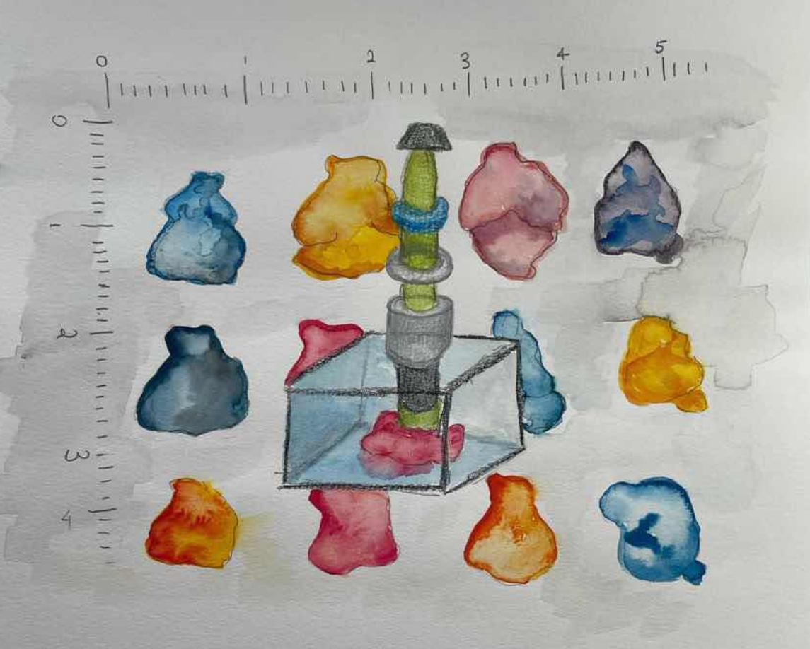

{}
Article originally published in [Issue 26 of Grey Matters Journal](https://greymattersjournal.org/navigating-the-cosmos-of-whole-brain-imaging/).
{}

{}
As of April 2024, [funding for the BRAIN Initiative has been cut by 40%](https://braininitiative.nih.gov/news-events/blog/brain-director-funding-neuroscience-uncertain-budget-climate). This will be massively destructive to the progress of the entire field of neuroscience and the livelihood of researchers, their families, and patients. Research described in this article and much, much more would not have been possible without funding from the BRAIN Initiative. Please take the time to [reach](https://twitter.com/BIONIC_Lab/status/1779497706819318074) [out](https://twitter.com/doristsao/status/1783669451533242526) to your Senators and Representatives!([example template from Twitter here](https://twitter.com/BrainsExplained/status/1779582134115561603))
{}

*Art by [Allison Li](https://greymattersjournal.org/author/allison/).*

## Mapping the (B)rainforest

Neurons, with their long axons and countless branching dendrites, are often colloquially spoken of in the language of trees. To extend the metaphor likens the brain to a vast forest, as densely packed and diversely populated as the Amazon Rainforest. To guide our exploration of the brain we must carefully map it, much like we have mapped the jungle. Indeed, neuroscientists have started by sketching out the approximate location of regions and the connections stretching between them. Similar to the layers of the rainforest, each brain region has unique properties based on the populations of neurons that make it up and their relationship to one another and other regions of the brain. Maps of the brain have become increasingly detailed as the field progresses to account for this complexity. Regional and subregional borders have been defined, and researchers have begun to further characterize the varied neuronal populations within and across these regions. 

These mapping endeavors are essential to understanding complex behaviors driven by neural circuits, and their functions in health and disease. However, despite the continuing evolution of the field, most of the forest’s secrets still loom, tall and untold; the neurological bases of the majority of neuropsychiatric diseases continue to evade us.

In the past decade, in recognition of the importance of brain mapping, several concerted efforts have been made to fund research: the US BRAIN Initiative (Brain Research through Advancing Innovative Neurotechnologies), the European Commission Human Brain Project, and the Japan Brain/Minds (Brain Mapping by Integrated Neurotechnologies for Disease Studies) all have the goal of mapping the entirety of the human brain [^1]. Together, the projects funded by these initiatives comprise the most ambitious expedition in biological mapping since the Human Genome Project, which mapped and sequenced all the genes of the human genome. Thus far, this odyssey in brain mapping has produced remarkable results. The last two decades alone have seen the creation of standardized guides for the mouse, rat, and primate brain, such as the Allen Brain Atlas. First published in 2012, this atlas ensures consistency in region names and borders, as well as provides detailed characterization of each region’s neuronal populations [^2]. As recently as 2021, a cross-species atlas was released by the BRAIN Initiative Cell Consensus Network (BICCN) mapping out the mammalian motor cortex by molecular, genetic, and spatial information [^3]. Brain maps continue to be improved to this day. Much like the Human Genome Project has done for genetic diseases, mapping the human brain will help shed light on the unknown aspects of neurological diseases. This includes locating the specific populations of neurons impacted, identifying more precise clinical symptoms, and designing targeted medications with more accurate predictions of their effects [^4].

Progress in brain mapping has been driven and accompanied by technological advancements. The most fundamental of these advancements has been the marriage of physics and neuroscience techniques, allowing the use of high-resolution imaging technology to study the brain and its structural and functional connections. Particularly prominent is the light-sheet fluorescence microscope (LSFM), which combines the potential of two technologies pioneered at the start of the twentieth century: tissue clearing and light-sheet fluorescence microscopy [^4]. Tissue clearing techniques make biological tissue transparent, giving scientists a clearer picture of the structure of target tissues. Early experiments were often conducted on human tissue samples and offered twentieth-century anatomists clarity in the structural organization of the heart and other organs. Without the power of high-resolution imaging technology, anatomists were unable to quantify their observations through detailed measurements, such as cell count or cell geometry. Despite being invented around the same time as tissue clearing, light-sheet microscopy took nearly a hundred years to make its way into the field of biology. The technology first found its footing in the hands of physicists, who developed the first light-sheet microscope, the Ultramicroscope, to view and quantify minuscule particles in solution. At the time, without the power of electron microscopy, the Ultramicroscope was one of the only ways to see particles too small to be seen with normal light microscopes and was soon used to study the architecture of cells uncaptured by the capabilities of existing microscopes [^4]. 

Today, LSFM, accompanied by high-powered electric cameras for imaging and 3D reconstruction software, allows scientists to map and profile neuronal populations in all three dimensions [^5]. The brain-wide maps captured by the LSFM are like no other; rather than being limited to the borders of brain regions, they illuminate the global distribution of neuronal populations [^6]. Illustrations of the spread of different types of neurons throughout the brain have become increasingly relevant. LSFM and other methods for recording population-level neural activity have provided evidence for the dynamic role of globally connected networks of neurons in complex behavior symptomatic to substance use disorders and neuropsychiatric conditions [^7] [^8].

## Picturing the Brain at High Resolutions

To explore LSFM’s potential, we must first understand how the physical depiction of the brain created by the LSFM differs from those generated by fMRI and electrophysiological recordings, both of which were previously employed to map the brain.  Ultimately, each type of brain imaging seeks to characterize the brain in different ways. Some of these unique neural depictions focus on anatomical activity, such as the brain atlases, while others conventionally characterize the brain via its activity, such as electrophysiology. 

Electrophysiological recording methods are perhaps what most envision when imagining a depiction of brain activity: electrical changes from an individual neuron. To this day, electrophysiology is the only way in which brain activity can be recorded directly, through an electrode inserted in a single neuron, measuring the voltage changes across its cell membrane [^9].

However, its fatal flaw is linked to its strength. To record from a group of neurons would require multiple electrodes able to capture electrical changes across the entire group [^9]. To record on the scale of the whole brain would require large-scale implants that would likely damage the brain itself. Moreover, single-cell electrophysiological recordings are more imprecise than they may seem. Researchers typically know the general area or depth an electrode must be implanted at, but must follow up with post-experiment verification to ensure they were recording from the correct brain region. Additionally, the process of analyzing these recordings in bulk is time-intensive. The field of electrophysiology has, in recent years, seen the development of technologies such as the Neuropixel, capable of capturing single-cell neural activity in mice in hundreds of neurons simultaneously. Yet, it remains far from capturing the brain's activity as a whole and is generally disfavored because the surgical process itself is highly invasive [^9]. 

Enter fMRI, another well-known method for recording brain activity. fMRI does exactly what electrophysiology cannot—it captures brain activity as a whole [^10]. fMRI measures brain activity by monitoring blood oxygen levels, with higher oxygen levels correlating with increased neuronal activity. fMRI recordings, unlike electrophysiology, cannot inform researchers of what activity is occurring in the brain on a single-cell level. However, as the regional activity information fMRI does provide encompasses the entire brain, fMRI has dominated the field of brain mapping since the early 1990s. fMRI recordings have proven especially instrumental in mapping the human brain. As fMRI is more indirect in its method of measuring brain activity than electrophysiology, it doesn’t require the same invasive surgical procedures necessary to implant electrodes, making it the preferred method for research studies with human subjects [^10]. 

fMRI data maps the brain from the perspective of connectomics, the neural connections that make up the human brain [^10]. These maps, or connectomes, provide insight into both structural connections between regions of the brain and activity-based or functional connections. In other words, a map of the human connectome would include information not only on all the different paths connecting each region of the brain, but also the set of paths used or active during a specific condition. This builds on the knowledge a researcher may gain from conducting electrophysiological experiments first. After observing a difference in activity in a particular region of a diseased brain in an animal model, as recorded through electrophysiological methods, a researcher can interrogate widespread activity changes in related regions in human patients using fMRI. In this way, they can validate that these differences seen in the patient are caused by the disease of interest, because they see a similar change in activity in the region they first investigated. By taking fMRI recordings from a sufficient number of patients with the disease of interest, researchers can also begin building a cross-species connectome detailing the specific activity patterns characteristic of the disease across these many patients [^10].

For a disease or neuropsychiatric disorder of interest, the first piece of the puzzle was electrophysiology, which provided detailed activity of neurons in an affected brain region. The next piece was fMRI, which illustrated how affected brain regions are connected. What completes the puzzle? LSFM, which identifies what these affected neurons are, and where they are located.

Light-sheet microscopy applications primarily use biomarkers—genetic markers or proteins— to characterize neural populations [^11]. They take advantage of existing fluorescence imaging methods, which were previously the standard for high-resolution visualization of biomarker distribution throughout the brain. A drawback of these approaches is that they cannot capture the specific time-dependent patterns of neural activity involved in a behavior of interest [^11]. Using genetic markers instead captures changes in gene expression (either in markers of neuronal activity or markers that further characterize active neurons) that underlie a particular behavior. For example, electrophysiological approaches can tell us if a population of neurons in the lateral septum is firing during aggression (and can tell us what these firing patterns look like in detail). But without further characterizing these neurons by the other genes they might express, we do not know why we’re seeing the firing patterns that we do or the mechanisms behind the behavior observed. The particular expression or coexpression patterns of genes of interest may help us answer these questions. 

Each neuron of the brain is labeled for this purpose either through the use of transgenic lines of mice, or through immunohistochemistry (IHC) assays [^11]. Transgenic mice are bred to express a ‘locked’ version of a genetic marker in specific populations of neurons. The expression of this marker in these neurons can typically only be unlocked if another condition is met, such as if the neurons are active. In this manner, neurons can be precisely categorized [^11].

IHC functions similarly, giving researchers insight into the distribution of biomarkers across an organ’s landscape of tissues [^11]. Rather than requiring a specific genetically engineered animal, the process of staining occurs once an animal has been sacrificed and tissue samples have been harvested and prepared. Brains used for IHC are typically sliced, and brain slices containing sections of a brain region of interest are stained. While it was possible to stitch many slice images together to create a 3D representation of the brain before the LFSM, the process was time-consuming and prone to mechanical distortions of the final image. Tissue clearing, in combination with the modern capabilities of the LSFM, allows for this staining to occur in three dimensions that span the entirety of the brain in a far more efficient and less error-prone manner [^11]. The result is an intricate scattering of biomarkers against the background of the brain: a galaxy, each fluorescently labeled cell a bright star.

These maps of expression differ from cell type maps in that they’re activity-dependent. LSFM representations of the brain are tied to the conditions that generated them. In other words, a diseased brain cleared, stained, and imaged on the light-sheet for a neural activity marker would produce a galaxy of active neurons particular to that disease— a disease fingerprint researchers can use as a reference for further manipulations, as well as use to help diagnose patients in the future. These fingerprints could prove especially insightful in decoding neuropsychiatric disorders, which are often hard to otherwise diagnose due to the overlap in behavioral manifestations between disorders.

## Seeing the Light(sheet)

Previously known as the ‘ultramicroscope,' the light-sheet functions by illuminating a sample suspended in a small chamber with a ‘sheet’ of light that bisects the sample laterally [^11]. Unlike traditional microscopes, all parts of the sample are in the dark besides the slice lit with the sheet of light, which reduces the amount of photobleaching, or overexposure, leading to decreased fluorescence in planes of the sample not currently in focus. Moreover, the light-sheet microscope’s large field of view allows for imaging samples as large as the entire mouse brain. These characteristics made it an extremely promising technology for visualizing the whole brain in three dimensions. The ultramicroscope could be used for whole-brain fluorescence mapping without the effort of slicing and stitching together slice images. In this way, researchers were theoretically now able to visualize all neural circuits active during a behavior, as opposed to just one. The only limiting factor to the microscope was the computational power necessary to record the massive scale of images generated by ‘slicing’ through the entire brain and used to create a 3D digital reconstruction of it [^11]. 

This limitation was overcome with the turn of the century, and its accompanying technological progress. In 2007, almost a hundred years after both the light-sheet and tissue-clearing methods were first developed, Hans-Ulrich Dodt and colleagues combined the two techniques to image the whole, intact mouse brain [^11]. They tested the potential of the light-sheet in several capacities: in mapping transgenically labeled neurons in the whole brains of transgenic mice, and in imaging autofluorescence in developing mouse brains and flies. The light-sheet proved itself in both regards. By mapping transgenically labeled neurons throughout the entire brain, Dodt and colleagues proved that as previously hypothesized, the ultramicroscope could be used to capture brainwide activity on a single neuron level. Moreover, the autofluorescence imaging revealed to Dodt and colleagues the organization of blood vessels and other vasculature that fluorescence naturally when excited by the microscope’s light. They found several strongly innately fluorescent brain structures in the developing mouse brain, and imaging brains that were further along in the development process, they also visualized myelinated fiber tracts [^11]. This gave the researchers a more complete picture of the mouse brain, both anatomically and functionally.

But in the initial foray, researchers still found themselves limited [^11]. Despite technological advances, their computing power was still only strong enough to reconstruct 600 images at the desired resolution in a 3D brain rendering. For context, a mouse brain imaged with light-sheet microscopy today averages over a thousand images per reconstruction. The tissue-clearing procedure to prep the mice brains for imaging was also far from perfect. Mouse brains older than two weeks were not completely imaged due to the persistence of fat residues on more myelinated or fat-insulated regions of the brain. Moreover, deeper within the brain tissue, they observed a greater problem of autofluorescence, or the fluorescence of naturally occurring molecules still present in the tissue, which can make it difficult to properly view experimental fluorescent markers [^11].

## Clearing Things Up

All described tissue-clearing methods operate using the same basic physical principles of improving tissue clarity by minimizing light scattering and untargeted light absorption [^5]. For the brain, this has primarily been accomplished through the removal of lipids, a major source of light scattering in a sample brain, or through minimization of the lipids’ light scattering effect. Minimizing the light scattered by an object requires adjusting the refractive indices (RIs) of the object and its surroundings. The smaller the difference between the two RIs, the less light scattering occurs, because light passing from outside the sample to through it refracts or bends less. Tissue-clearing methods work to homogenize these indices by matching the RIs of the sample and its surrounding solution. Reagents involved react with substances in the brain to either decolorize them or to change their RI to a value more similar to the sample’s surroundings. Typically, these reactions involve the removal of lipids, pigments, or other reactive molecules that affect RI in biological samples. The RI of a sample can also be changed if the sample physically expands [^5].

Dodt and colleagues used an existing tissue-clearing protocol based on hydrophobic reagents. Similar clearing methods, such as iDISCO, are still popular to this day for their fairly rapid and robust clearing ability [^12]. Regardless of these advantages, these reagents sometimes ‘quench’ fluorescence, causing their brightness to diminish significantly and making markers harder to detect [^12]. Since then, neuroscientists have developed other methods to clear brain samples. Hydrophilic mixtures, such as SeeDB or Scale, cleared tissue with reduced quenching and were engineered to preserve fluorescent signals [^13] [^14]. These reagents have the added benefit of being less toxic than chemicals used in hydrophobic approaches and preserve more of the brain’s original tissue structure. However, they fail to clear the deeper regions of the brain, and the resulting transparency of the brain isn’t clear enough for light-sheet microscopy to be optimally effective [^13] [^14]. To address this shortcoming, a year after the development of SeeDB, Hiroki Ueda and colleagues developed CUBIC, a chemical cocktail-based clearing approach that utilized a mix of hydrophobic and hydrophilic reagents that cleared tissue with the depth of hydrophobic approaches and the delicacy of hydrophilic approaches [^15]. Further chemical screening and cocktail mixing led to the development of several CUBIC reagents that each served a particular purpose: CUBIC-L or CUBIC-HL for general delipidation, CUBIC-R+ for RI matching, CUBIC-P for decolorization, and CUBIC-X for tissue expansion [^15].

The development of a third method of clearing the brain, CLARITY, coincided with the development of hydrophilic and hydrophobic tissue-clearing methods [^16]. CLARITY, developed by Karl Deisseroth’s group in 2013, was the first hydrogel-based method, in which electrophoresis is used to accelerate the perfusion of detergents through the tissue, which quickly transforms it into a clear gel-like substance that retains the overall position and structure of previous biological elements. The processes undertaken in CLARITY make fluorescence imaging extremely challenging—as markers are not preserved—however, brains processed through CLARITY can be imaged at extremely high resolution. In more recent years, just as hydrophilic and hydrophobic methods have undergone several iterations, the reagents of the hydrogel-based method have also been screened and swapped out to target the process [^16]. Of particular note is the SHIELD protocol, developed by the lab of Kwanghun Chung (who led the development of CLARITY in the Deisseroth Lab) which uses several chemicals to stabilize the brain tissue throughout the clearing process, preserving the structural integrity of the brain tissue, as well as fluorescence for imaging [^17]. SHIELD is currently considered to be the best of the tissue-clearing protocols when it comes to tissue clarity, but the cleared brains it produces often are more prone to falling apart than other methods [^17]. As the field continues to progress, drawing from the successes and failures of each protocol, researchers will surely gain an even clearer picture of the brain.

## Using Your Whole Brain

The recency of the use of LSFM in the field of neuroscience means that it is still a method rapidly evolving, from the optimization of the microscope itself, to the fine-tuning of tissue-clearing methods for neuroscience research, to how researchers analyze the data outputs. While LSFM datasets hold massive potential, exploration of this potential has been hindered by the scale of the datasets involved. The process of cell counting had been automated prior to the rise of LSFM, however, it had never been done on the scale of hundreds of millions of neurons. Automated analysis of whole-brain images became possible in 2016, with the release of the open-source program ClearMap [^18]. ClearMap not only counts cells in all three dimensions, but it registers their location to regions based on reference atlases such as the Allen Brain Atlas, and generates regional distribution maps and statistical analyses based on these counts. The developers of ClearMap showed its range of applications, mapping in detail the cells activated in response to an antipsychotic drug by brain region, in exploration of a novel environment, and tracing the connections between neurons during parenting activity [^18]. A commentary on the software shortly after its release proposed its use in understanding the short and long-term effects of medications or neurodegeneration on brain activity, as well as understanding changes in brain activity as a result of processes as mundane as sleep, exercise, or aging [^19]. The use of ClearMap may additionally help elucidate the specific functions of biomarkers often used to track neural activity but not thoroughly understood.

ClearMap has since been used to analyze the whole-brain data from experiments examining the brain-wide activity triggered by drugs such as ketamine and psilocybin to the patterns underlying long-term fear memory and alcohol dependence [^7] [^20] [^21]. Along with countless other behaviors that are often symptomatic of neuropsychological disorders, such as craving or maladaptive social behavior, these two are currently best understood on the scale of neural circuits. LSFM data, processed through ClearMap, gives researchers a more complete picture of the widespread activation changes underlying these behaviors. Showcasing the power of understanding the brain from a global perspective rather than a regional one, results thus far have proven promising. They’ve provided insight into how co-activational relationships between brain regions differ under distinctive behavioral conditions [^22]. In other words, the brain’s galaxy of activity seems to organize itself into constellations unique to certain behaviors. The key to understanding neuropsychiatric disorders is to map out how these patterns of activity differ from the norm.

## A Light(sheet) in the Dark

Single-cell whole-brain datasets hold the potential to drive neuropsychiatric disorder research in a new direction. An important consideration in optimizing the full use of these datasets has been how best to analyze them. Until recently, researchers have approached analysis using conventional statistical methods—comparing the mean level of activation between brain regions for statistical differences or measuring the correlation between regions based on the level of activation. However, these datasets are representative of the brain in all of its complexity, which cannot be captured by these measures alone. To discover previously unknown brain networks that operate across multiple dimensions, the analysis methods researchers employ must be novel. Indeed, several researchers have risen to the challenge. 

To take their whole brain analyses a step further, Kimbrough and colleagues returned to theories of activity-based brain organization that shaped the direction of fMRI-based brain mapping [^7]. This gave them additional insight into the changes in co-activational relationships over time in response to differing levels of alcohol dependence. They found that with an increased dependence on alcohol, during an abstinence period, a greater number of brain regions were co-activated. In other words, co-activational relationships in the alcohol-dependent brain were re-organized from that of the non-dependent brain, and more brain regions were activated in coordination with one another during abstinence. This data reflected the results of similar studies conducted in human patients using fMRI, which found that the functional networks or modules the brain organizes itself into for particular behaviors are disrupted in dementia and traumatic brain injury [^23] [^24]. However Kimbrough’s study reflects a major limitation in integrating brain mapping methods: it uses only 84 brain regions in its analysis, despite the Allen Brain Atlas segmenting the brain into over 900 different regions [^7]. This makes their results less readily applicable to our understanding of the whole brain’s functioning. But as a proof of concept, the results of Kimbrough and colleagues’ method are encouraging [^7]. Using their framework, researchers may discover new targets for therapeutic intervention by identifying key regions within these modules that potentially drive the neural activity in networks altered by brain injury or neuropsychiatric disorder.

A study led by Laura DeNardo from Liqun Luo's lab approached the question of analysis differently [^20]. After obtaining counts of activated cells by brain region from ClearMap, they used machine learning-based methods to cluster brain regions by activation. The more similar brain regions were in several activated cells, the more likely they were to cluster together. Brain regions that made up a single cluster were likely co-activated. By examining which brain regions were grouped by activity-based measures alone, DeNardo and colleagues were able to gain insight similar to Kimbrough on the co-activational relationships organizing regions of the brain. In their experiment, DeNardo and colleagues noted the brain regions associated with the prelimbic cortex—key to emotional processing and memory— in recalling fear memories after different intervals in time. Going a step further, they additionally correlated counts of activated cells by regions to measurements of their observed behavior [^20]. If researchers continue to examine the relationship between neuronal activation and behavior, they may grow closer to discovering the specific neural substrates of behaviors symptomatic to neuropsychiatric disorders that are otherwise hard to identify or characterize. Such research may also aid in diagnosis by differentiating between behaviors common to multiple disorders; these behaviors may be distinct on a neural level.

The more researchers study the brain, the more they realize how increasingly difficult it is to define. The collection of cells we use to think every day is far more of a vast, unexplored jungle than one might imagine. Charting a way through it is the only way to push the field forward in helping researchers develop treatments for patients with neuropsychiatric diseases and disorders. Mapping the human brain will likely be a long and arduous process, the path of which will at times be uncertain and dark. Luckily we have a light-sheet.

### **Check out the rest of Issue 26 of Grey Matters Journal [here](https://greymattersjournal.org/tag/issue-26/)!**

[^1]: Abbott, A (2021 October 22). “How the world’s biggest brain maps could transform neuroscience.” Nature news.
    [https://www.nature.com/articles/d41586-021-02661-w](https://www.nature.com/articles/d41586-021-02661-w )
[^2]: Sunkin, S. M., Ng, L., Lau, C., Dolbeare, T., Gilbert, T. L., Thompson, C. L., Hawrylycz, M., & Dang, C. (2013). Allen
    Brain Atlas: an integrated spatio-temporal portal for exploring the central nervous system. Nucleic acids research, 41(Database issue), D996–D1008. [https://doi.org/10.1093/nar/gks1042](https://doi.org/10.1093/nar/gks1042)
[^3]: BRAIN Initiative Cell Census Network (BICCN) (2021). A multimodal cell census and atlas of the mammalian primary motor
    cortex. Nature, 598(7879), 86–102. [https://doi.org/10.1038/s41586-021-03950-0 ](https://doi.org/10.1038/s41586-021-03950-0 )
[^4]: The BRAIN Initiative. About. [https://braininitiative.nih.gov/about/overview ](https://braininitiative.nih.gov/about/overview)
[^5]: Ueda, H. R., Dodt, H. U., Osten, P., Economo, M. N., Chandrashekar, J., & Keller, P. J. (2020). Whole-Brain Profiling of
     Cells and Circuits in Mammals by Tissue Clearing and Light-Sheet Microscopy. Neuron, 106(3), 369–387. [https://doi.org/10.1016/j.neuron.2020.03.004](https://doi.org/10.1016/j.neuron.2020.03.004)
[^6]: Newmaster, K. T., Kronman, F. A., Wu, Y. T., & Kim, Y. (2022). Seeing the Forest and Its Trees Together: Implementing 3D 
    Light Microscopy Pipelines for Cell Type Mapping in the Mouse Brain. Frontiers in neuroanatomy, 15, 787601. [https://doi.org/10.3389/fnana.2021.787601](https://doi.org/10.3389/fnana.2021.787601)
[^7]: Kimbrough, A., Lurie, D. J., Collazo, A., Kreifeldt, M., Sidhu, H., Macedo, G. C., D'Esposito, M., Contet, C., & George, O.
    (2020). Brain-wide functional architecture remodeling by alcohol dependence and abstinence. Proceedings of the National Academy of Sciences of the United States of America, 117(4), 2149–2159. [https://doi.org/10.1073/pnas.1909915117](https://doi.org/10.1073/pnas.1909915117) 
[^8]: Kimbrough, A., Kallupi, M., Smith, L. C., Simpson, S., Collazo, A., & George, O. (2021). Characterization of the Brain
    Functional Architecture of Psychostimulant Withdrawal Using Single-Cell Whole-Brain Imaging. eNeuro, 8(6), ENEURO.0208-19.2021. [https://doi.org/10.1523/ENEURO.0208-19.2021](https://doi.org/10.1523/ENEURO.0208-19.2021)
[^9]: Jun, J. J., Steinmetz, N. A., Siegle, J. H., Denman, D. J., Bauza, M., Barbarits, B., Lee, A. K., Anastassiou, C. A.,
    Andrei, A., Aydın, Ç., Barbic, M., Blanche, T. J., Bonin, V., Couto, J., Dutta, B., Gratiy, S. L., Gutnisky, D. A., Häusser, M., Karsh, B., Ledochowitsch, P., … Harris, T. D. (2017). Fully integrated silicon probes for high-density recording of neural activity. Nature, 551(7679), 232–236. [https://doi.org/10.1038/nature24636](https://doi.org/10.1038/nature24636)
[^10]: Scarapicchia, V., Brown, C., Mayo, C., & Gawryluk, J. R. (2017). Functional Magnetic Resonance Imaging and Functional
    Near-Infrared Spectroscopy: Insights from Combined Recording Studies. Frontiers in human neuroscience, 11, 419. [https://doi.org/10.3389/fnhum.2017.00419](https://doi.org/10.3389/fnhum.2017.00419) 
[^11]: Dodt, H. U., Leischner, U., Schierloh, A., Jährling, N., Mauch, C. P., Deininger, K., Deussing, J. M., Eder, M., 
    Zieglgänsberger, W., & Becker, K. (2007). Ultramicroscopy: three-dimensional visualization of neuronal networks in the whole mouse brain. Nature methods, 4(4), 331–336. [https://doi.org/10.1038/nmeth1036](https://doi.org/10.1038/nmeth1036)
[^12]: Renier, N., Wu, Z., Simon, D. J., Yang, J., Ariel, P., & Tessier-Lavigne, M. (2014). iDISCO: a simple, rapid method to
     immunolabel large tissue samples for volume imaging. Cell, 159(4), 896–910. [https://doi.org/10.1016/j.cell.2014.10.010 ](https://doi.org/10.1016/j.cell.2014.10.010)
[^13]: Ke, M. T., Fujimoto, S., & Imai, T. (2013). SeeDB: a simple and morphology-preserving optical clearing agent for neuronal
     circuit reconstruction. Nature neuroscience, 16(8), 1154–1161. [https://doi.org/10.1038/nn.3447](https://doi.org/10.1038/nn.3447)
[^14]: Hama, H., Kurokawa, H., Kawano, H., Ando, R., Shimogori, T., Noda, H., Fukami, K., Sakaue-Sawano, A., & Miyawaki, A. 
    (2011). Scale: a chemical approach for fluorescence imaging and reconstruction of transparent mouse brain. Nature neuroscience, 14(11), 1481–1488. [https://doi.org/10.1038/nn.2928](https://doi.org/10.1038/nn.2928)
[^15]: Matsumoto, K., Mitani, T. T., Horiguchi, S. A., Kaneshiro, J., Murakami, T. C., Mano, T., Fujishima, H., Konno, A.,
    Watanabe, T. M., Hirai, H., & Ueda, H. R. (2019). Advanced CUBIC tissue clearing for whole-organ cell profiling. Nature protocols, 14(12), 3506–3537. [https://doi.org/10.1038/s41596-019-0240-9](https://doi.org/10.1038/s41596-019-0240-9)
[^16]: Chung, K., Wallace, J., Kim, S. Y., Kalyanasundaram, S., Andalman, A. S., Davidson, T. J., Mirzabekov, J. J., Zalocusky,
    K. A., Mattis, J., Denisin, A. K., Pak, S., Bernstein, H., Ramakrishnan, C., Grosenick, L., Gradinaru, V., & Deisseroth, K. (2013). Structural and molecular interrogation of intact biological systems. Nature, 497(7449), 332–337. [https://doi.org/10.1038/nature12107](https://doi.org/10.1038/nature12107) 
[^17]: Park, Y. G., Sohn, C. H., Chen, R., McCue, M., Yun, D. H., Drummond, G. T., Ku, T., Evans, N. B., Oak, H. C., Trieu, W.,
    Choi, H., Jin, X., Lilascharoen, V., Wang, J., Truttmann, M. C., Qi, H. W., Ploegh, H. L., Golub, T. R., Chen, S. C., Frosch, M. P., … Chung, K. (2018). Protection of tissue physicochemical properties using polyfunctional crosslinkers. Nature biotechnology, 10.1038/nbt.4281. Advance online publication. [https://doi.org/10.1038/nbt.4281](https://doi.org/10.1038/nbt.4281)
[^18]: Renier, N., Adams, E. L., Kirst, C., Wu, Z., Azevedo, R., Kohl, J., Autry, A. E., Kadiri, L., Umadevi Venkataraju, K., 
    Zhou, Y., Wang, V. X., Tang, C. Y., Olsen, O., Dulac, C., Osten, P., & Tessier-Lavigne, M. (2016). Mapping of Brain Activity by Automated Volume Analysis of Immediate Early Genes. Cell, 165(7), 1789–1802. [https://doi.org/10.1016/j.cell.2016.05.007](https://doi.org/10.1016/j.cell.2016.05.007) 
[^19]: Hrvatin, S., Nagy, M. A., & Greenberg, M. E. (2016). Catching the Brain in the Act. Cell, 165(7), 1570–1571. 
    [https://doi.org/10.1016/j.cell.2016.06.008](https://doi.org/10.1016/j.cell.2016.06.008) 
[^20]: DeNardo, L. A., Liu, C. D., Allen, W. E., Adams, E. L., Friedmann, D., Fu, L., Guenthner, C. J., Tessier-Lavigne, M., & 
    Luo, L. (2019). Temporal evolution of cortical ensembles promoting remote memory retrieval. Nature neuroscience, 22(3), 460–469. [https://doi.org/10.1038/s41593-018-0318-7](https://doi.org/10.1038/s41593-018-0318-7)
[^21]: Davoudian PA, Shao LX, Kwan AC (2022). Shared and distinct brain regions targeted for immediate early gene expression by
     ketamine and psilocybin. BioRxiv. [https://doi.org/10.1101/2022.03.18.484437](https://doi.org/10.1101/2022.03.18.484437) 
[^22]: Wheeler, A. L., Teixeira, C. M., Wang, A. H., Xiong, X., Kovacevic, N., Lerch, J. P., McIntosh, A. R., Parkinson, J., & 
    Frankland, P. W. (2013). Identification of a functional connectome for long-term fear memory in mice. PLoS computational biology, 9(1), e1002853. [https://doi.org/10.1371/journal.pcbi.1002853](https://doi.org/10.1371/journal.pcbi.1002853)
[^23]: Brier, M. R., Thomas, J. B., Fagan, A. M., Hassenstab, J., Holtzman, D. M., Benzinger, T. L., Morris, J. C., & Ances, B.
    M. (2014). Functional connectivity and graph theory in preclinical Alzheimer's disease. Neurobiology of aging, 35(4), 757–768. [https://doi.org/10.1016/j.neurobiolaging.2013.10.081](https://doi.org/10.1016/j.neurobiolaging.2013.10.081)
[^24]: Arnemann, K. L., Chen, A. J., Novakovic-Agopian, T., Gratton, C., Nomura, E. M., & D'Esposito, M. (2015). Functional brain
    network modularity predicts response to cognitive training after brain injury. Neurology, 84(15), 1568–1574. [https://doi.org/10.1212/WNL.0000000000001476](https://doi.org/10.1212/WNL.0000000000001476) 